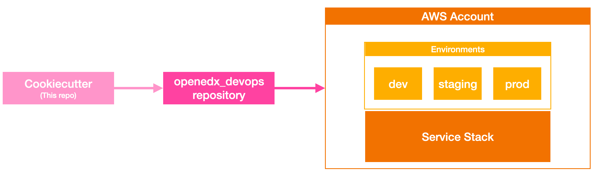
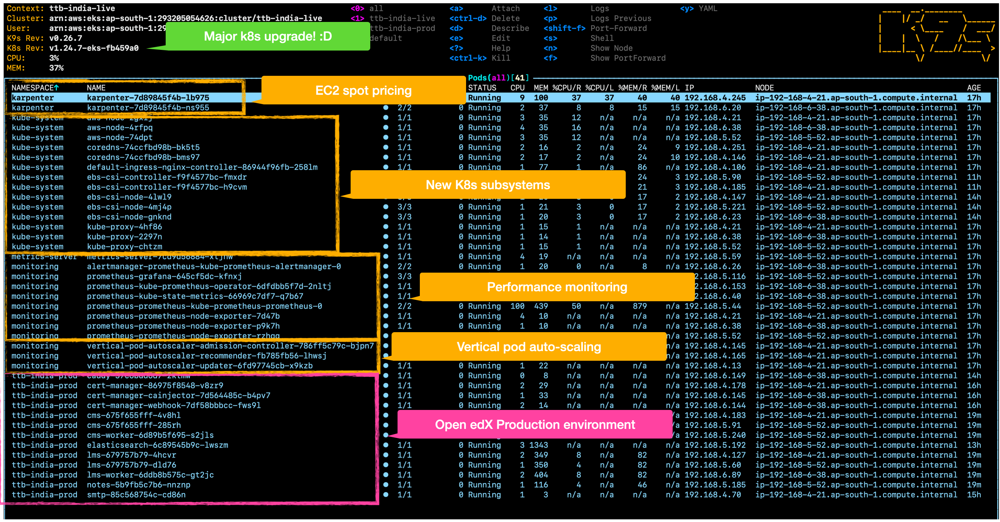

Cookiecutter Open edX Devops Tools
==================================
.. image:: https://img.shields.io/badge/hack.d-Lawrence%20McDaniel-orange.svg
  :target: https://lawrencemcdaniel.com
  :alt: Hack.d Lawrence McDaniel

.. image:: https://img.shields.io/static/v1?logo=discourse&label=Forums&style=flat-square&color=ff0080&message=discuss.overhang.io
  :alt: Forums
  :target: https://discuss.openedx.org/

.. image:: https://img.shields.io/static/v1?logo=readthedocs&label=Documentation&style=flat-square&color=blue&message=docs.tutor.overhang.io
  :alt: Documentation
  :target: https://docs.tutor.overhang.io
|
.. image:: https://img.shields.io/badge/terraform-%235835CC.svg?style=for-the-badge&logo=terraform&logoColor=white
  :target: https://www.terraform.io/
  :alt: Terraform

.. image:: https://img.shields.io/badge/AWS-%23FF9900.svg?style=for-the-badge&logo=amazon-aws&logoColor=white
  :target: https://aws.amazon.com/
  :alt: AWS

.. image:: https://img.shields.io/badge/docker-%230db7ed.svg?style=for-the-badge&logo=docker&logoColor=white
  :target: https://www.docker.com/
  :alt: Docker

.. image:: https://img.shields.io/badge/kubernetes-%23326ce5.svg?style=for-the-badge&logo=kubernetes&logoColor=white
  :target: https://kubernetes.io/
  :alt: Kubernetes
|

.. image:: https://avatars.githubusercontent.com/u/40179672
  :target: https://openedx.org/
  :alt: OPEN edX
  :width: 75px
  :align: center

.. image:: https://overhang.io/static/img/tutor-logo.svg
  :target: https://docs.tutor.overhang.io/
  :alt: Tutor logo
  :width: 75px
  :align: center

|

Powered by `Cookiecutter <https://github.com/cookiecutter/cookiecutter>`_, Cookiecutter Open edX Devops Tools is a community maintained project template for jumpstarting production-ready, `Kubernetes <https://kubernetes.io/>`_-based installations of the `Open edX <https://openedx.org/>`_ online learning management system running on `AWS <https://aws.amazon.com/>`_ cloud infrastructure that is built and managed with fully parameterized `Terraform <https://www.terraform.io/>`_ and `Github Actions <https://docs.github.com/en/actions>`_ automation scripts. The template offers a number of generation options, we invite you to check the dedicated `docs <https://github.com/lpm0073/cookiecutter-openedx-devops/tree/main/doc>`_ pages to learn more about each of them.

Scalable and Secure
-------------------

Builds a fully functional Docker-based, horizontally-scaled Open edX installation running on AWS infrastructure.

Complete Kubernetes Auto scaling
--------------------------------

Your new Kubernetes infrastructure platform leverages `Prometheus <https://prometheus.io/>`_ and `metrics-server <https://github.com/kubernetes-sigs/metrics-server>`_ to provide you with fully self-maintained auto-scaling features:

- `Vertical Pod Auto-scaling <https://github.com/kubernetes/autoscaler>`_: a set of Kubernetes components that automatically adjust the amount of CPU and memory requested by your running pods based on performance metrics collected real-time by prometheus and metrics-server.
- `Horizontal Pod Auto-scaling <https://kubernetes.io/docs/tasks/run-application/horizontal-pod-autoscale/>`_: a built-in Kubernetes feature that automatically updates the pod count of your application deployments with the aim of automatically scaling the workload to match demand.
- `Karpenter <https://karpenter.sh/>`_: automatically launches just the right number of AWS EC2 compute node (ie application server instance) resources to handle your cluster's applications. It is designed to let you take full advantage of the cloud with fast and simple compute provisioning for Kubernetes clusters.

Terraform-based AWS infrastructure management
---------------------------------------------

Your new repository includes Terraform modules that have been optimized for running Open edX at scale on AWS EKS and RDS. The modules are organized to ease your implementation of additional environments for `dev`, `test` and `qa`.
These modules will additionally configure all Open edX credentials (Django secret key, JWT, admin user, IAM keypairs, MySQL users and passwords, etcetera) on a per-environment basis, and will store these in Kubernetes Secrets.
This configuration scales automatically, reliably supporting anywhere from a few hundred to as many as several hundred thousand learners. This Terraform configuration is also designed to support your additional external systems. Your custom legacy systems and microservices can safely deploy to this same Kubernetes cluster and RDS MySQL cluster. Your new Kubernetes cluster includes preconfigured, state of the art systems to help you manage things, including `Metrics-Server <https://github.com/kubernetes-sigs/metrics-server>`_, `Promethius <https://prometheus.io/>`_, `Grafana <https://grafana.com/>`_ and `Karpenter <https://karpenter.sh/>`_.

**NEW IN VERSION 1.0.2: SPOT PRICING FOR EC2 INSTANCES** Save up to 75% off the cost of on-demand EC2 instances by using AWS' flexible `spot-pricing <https://aws.amazon.com/ec2/spot/pricing/>`_ .

**NEW IN VERSION 1.0.3:** an optional fully-configured remote MongoDB server running on an EC2 instance. Set cookiecutter.stack_add_remote_mongodb=Y to choose this option.

**NEW IN VERSION 1.0.5:** Kubernetes upgrade to 1.24, plus a new adminstrative server with all of the preinstalled software that you'll need to administer your Open edX platform. Set cookiecutter.stack_add_bastion=Y to choose this option.

**NEW IN VERSION 1.0.8:** `Kubernetes Dashboard <https://kubernetes.io/docs/tasks/access-application-cluster/web-ui-dashboard/>`_ and `Kubeapps <https://kubeapps.dev/>`_ web applications.

Github Workflows for Build and Deploy
-------------------------------------

Your new repository will be preconfigured to accept a collection of Github secrets parameters for your AWS IAM keypair, SMTP email host credentials, and oAuth provider credentials.

- CI workflows for building your customized Docker images for the Open edX platform and its optional modules.
- Built entirely from reusable `Open edX Github Actions <https://github.com/openedx-actions>`_ community-supported components that are purpose designed to support Open edX software running on Kubernetes.
- Deployment workflows for deploying your Open edX platform to your new AWS EKS Kubernetes cluster. The deployment workflow installs the latest stable versions of the following:
    - Open edX LMS and CMS
    - pre-scaffolded Open edX custom theme
    - pre-scaffolded example Open edX plugin
    - sample optional Xblock
    - Tutor plugin to offload user files to AWS S3 storage bucket
    - Tutor plugin to manage automated nightly MySQL and MongoDB backups
    - Tutor plugin for Discovery service
    - Tutor plugin for Micro Front-end service
    - Tutor plugin for Credentials service
    - Tutor plugin for Xqueue service
    - Tutor plugin for Ecommerce service
    - Tutor plugin for Discussion Forums
    - Tutor plugin for Notes service
    - add configuration hooks for enabling SMTP email

The Terraform scripts in your new repo will provide a 1-click means of creating / updating / destroying the following for each environment:

- LMS at https://courses.yourschool.edu
- CMS at https://studio.courses.yourschool.edu
- CDN at https://cdn.courses.yourschool.edu linked to a public read-only S3 bucket named courses-yourschool-virginia-storage
- public ssh access via a t2.micro Ubuntu 20.04 LTS bastion EC2 instance at bastion.courses.yourschool.edu
- daily data backups archived into a private S3 bucket named courses-yourschool-virginia-mongodb-backup

You can also optionally automatically create additional environments for say, dev and test and QA and so forth.
These would result in environments like the following:

- LMS at https://dev.courses.yourschool.edu
- CMS at https://studio.dev.courses-yourschool.edu
- CDN at https://cdn.dev.courses.yourschool.edu linked to an S3 bucket named dev-yourschool-virginia-storage
- daily data backups archived into an S3 bucket named dev-yourschool-virginia-mongodb-backup

Important Considerations
------------------------

- this Cookiecutter can only generate a GitHub repository.
- the Terraform code and Github Actions workflows in your new repository will only work for AWS.
- the application domain for your Open edX installation (ie courses.yourschool.edu) must be hosted in `AWS Route53 <https://console.aws.amazon.com/route53/v2/hostedzones#>`_. Terraform will create several DNS entries inside of this hosted zone, and it will optionally create additional hosted zones (one for each additional optional environment) that will be linked to the hosted zone of your application domain.
- the Github Actions workflows in your new repository will depend on secrets located in the repository settings page. Look for further instructions in the README of your new repository.
- the Github Actions workflows in your new repository will use an AWS IAM key pair from an IAM user named *ci* that you must manually create.
- the collection of resources created by these scripts **will generate AWS costs of around $0.41 USD per hour ($10.00 USD per day)** while the platform is in a mostly-idle pre-production state. This cost will grow proportionally to your production work loads.
- **BE ADVISED** that MySQL RDS, MongoDB and Redis ElastiCache are vertically scaled **manually** and therefore require some insight and potential adjustments on your part. All of these services are defaulted to their minimum instance sizes which you can modify in the environment configuration file.
- TO DO: `NSA Updated: Kubernetes Hardening Guide <https://www.cisa.gov/uscert/ncas/current-activity/2022/03/15/updated-kubernetes-hardening-guide>`_

Usage
-----

You use a popular command-line tool named `Cookiecutter <https://cookiecutter.readthedocs.io/>`_ to generate your git code repository using this repo as a template.

First, get Cookiecutter. Trust me, it's awesome:

.. code-block:: shell

    $ pip install "cookiecutter>=1.7.0"

Now run it against this repo, using the following example usage pattern:

.. code-block:: shell

    GITHUB_REPO="gh:lpm0073/cookiecutter-openedx-devops"
    GITHUB_BRANCH="main"
    OUTPUT_FOLDER="./"

    cookiecutter --checkout $GITHUB_BRANCH \
                --output-dir $OUTPUT_FOLDER \
                --overwrite-if-exists \
                --no-input \
                $GITHUB_REPO \
                global_platform_name=prod \
                global_platform_region=usa \
                global_aws_region=us-east-1 \
                global_account_id=012345678912 \
                global_root_domain=schoolofrock.edu \
                global_aws_route53_hosted_zone_id=Z123456789ABCDEFGHIJK \
                environment_name=prod \
                environment_subdomain=courses

Alternatively, you can run Cookiecutter without providing any prompts, which will result in it generating a questionnaire that includes all of the 75 or so input parameters. You'll be prompted for some values. Provide them, then a complete git repository will be created for you, with Github Actions workflows to automate the build and deployment of your Tutor Open edX platform, and Terraform scripts to automate the build of your AWS backend.

Answer the prompts with your own desired options. For example:

.. code-block:: shell

    $ cookiecutter https://github.com/lpm0073/cookiecutter-openedx-devops

    Cloning into 'cookiecutter-openedx-devops'...
    remote: Counting objects: 550, done.
    remote: Compressing objects: 100% (310/310), done.
    remote: Total 550 (delta 283), reused 479 (delta 222)
    Receiving objects: 100% (550/550), 127.66 KiB | 58 KiB/s, done.
    Resolving deltas: 100% (283/283), done.
    github_account_name [lpm0073]:
    github_repo_name [openedx_devops]:
    global_platform_name [yourschool]:
    global_platform_description [Your School]:
    global_platform_region [virginia]:
    global_root_domain [yourschool.edu]:
    # lots more questions .....

Enter the project and take a look around:

.. code-block:: shell

    cd openedx_devops/
    ls

Create a git repo and push it there:

.. code-block:: shell

  git init
  git add .
  git commit -m "first commit"
  git branch -M main
  git remote add origin https://github.com/lpm0073/openedx_devops.git
  git push -u origin main

Now take a look at your repo. Don't forget to carefully look at the generated README. Awesome, right?

Quick Start (After running Cookiecutter)
----------------------------------------

I. Add Your Secret Credentials To Your New Repository
~~~~~~~~~~~~~~~~~~~~~~~~~~~~~~~~~~~~~~~~~~~~~~~~~

The Github Actions workflows in your new repository will depend on several workflow secrets including two sets of AWS IAM keypairs, one for CI workflows and another for the AWS Simple Email Service.
Additionally, they require a Github Personal Access Token (PAT) for a Github user account with all requisite privileges in your new repository as well as any other repositories that are cloned during any of the build / installation pipelines.

.. image:: doc/repository-secrets.png
  :width: 700
  :alt: Github Repository Secrets

II. Review The Configuration For Your Open edX Back End
~~~~~~~~~~~~~~~~~~~~~~~~~~~~~~~~~~~~~~~~~~~~~~~~~~~~~~~

Review your global parameters. These will be pre-populated from your responses to the Cookiecutter command-line questionnaire.

.. code-block:: hcl

  locals {
    platform_name    = "yourschool"
    platform_region  = "virginia"
    root_domain      = "yourschool.edu"
    aws_region       = "us-east-1"
    account_id       = "123456789012"
  }

Review your production environment parameters.

.. code-block:: hcl

  locals {

  environment           = "courses"

                          # defaults to this value
  environment_domain    = "courses.yourschool.edu"

                          # defaults to this value
  environment_namespace = "courses-yourschool-virginia"

  # AWS infrastructure default sizing

                                    # 1 vCPU 2gb
  mysql_instance_class            = "db.t2.small"

                                    # 1 vCPU 1.55gb
  redis_node_type                 = "cache.t2.small"

                                    # 2 vCPU 8gb
  eks_worker_group_instance_type  = "t3.large"

                                      # 2 vCPU 8gb
  eks_karpenter_group_instance_type = "t3.large"

  }

III. Build Your Open edX Backend
~~~~~~~~~~~~~~~~~~~~~~~~~~~~~~~~

The backend build procedure is automated using `Terragrunt <https://terragrunt.gruntwork.io/>`_ for `Terraform <https://www.terraform.io/>`_.
Installation instructions are avilable at both of these web sites.

Terraform scripts rely on the `AWS CLI (Command Line Interface) Tools <https://aws.amazon.com/cli/>`_. Installation instructions for Windows, macOS and Linux are available on this site.
We also recommend that you install `k9s <https://k9scli.io/>`_, a popular tool for adminstering a Kubernetes cluster.

.. code-block:: shell

  # -------------------------------------
  # to manage an individual resource
  # -------------------------------------
  cd ./terraform/environments/{{ cookiecutter.environment_name }}/mysql
  terragrunt init
  terragrunt plan
  terragrunt apply
  terragrunt destroy

  # -------------------------------------
  # to build the entire backend
  # -------------------------------------

  # 1. create the VPC
  cd ./terraform/environments/{{ cookiecutter.environment_name }}/vpc
  terragrunt apply

  # 2. create the Elastic Kubernetes Cluster
  cd ../kubernetes
  terragrunt apply

  # 3. create everthing else
  cd ..
  terragrunt run-all apply

IV. Connect To Your new bastion server
~~~~~~~~~~~~~~~~~~~~~~~~~~~~~~~~~~~~~~

v1.01 introduced a newly designed bastion server with a complete set of preinstalled and preconfigured software for adminstering your
Open edX platform.

.. image:: doc/ec2-bastion.png
  :width: 100%
  :alt: Bastion Welcome Screen

V. Connect To Your backend Services
~~~~~~~~~~~~~~~~~~~~~~~~~~~~~~~~~~~~

Terraform creates friendly subdomain names for any of the backend services which you are likely to connect: Cloudfront, MySQL, Mongo and Redis.
Passwords for the root/admin accounts are accessible from Kubernetes Secrets. Note that each of MySQL, MongoDB and Redis reside in private subnets. These services can only be accessed on the command line from the Bastion.

.. code-block:: shell

  ssh bastion.courses.yourschool.edu -i path/to/yourschool-ohio.pem

  mysql -h mysql.courses.yourschool.edu -u root -p

  mongo --port 27017 --host mongo.master.courses.yourschool.edu -u root -p
  mongo --port 27017 --host mongo.reader.courses.yourschool.edu -u root -p

  redis-cli -h redis.primary.courses.yourschool.edu -p 6379

Specifically with regard to MySQL, several 3rd party analytics tools provide out-of-the-box connectivity to MySQL via a bastion server. Following is an example of how to connect to your MySQL environment using MySQL Workbench.

.. image:: doc/mysql-workbench.png
  :width: 700
  :alt: Connecting to MySQL Workbench

VI. Manage your new Kubernetes cluster
~~~~~~~~~~~~~~~~~~~~~~~~~~~~~~~~~~~~~

Installs four of the most popular web applications for Kubernetes administration:

- `k9s <https://k9scli.io/>`_, preinstalled in the optional EC2 Bastion server. K9s is an amazing retro styled, ascii-based UI for viewing and monitoring all aspects of your Kubernetes cluster. It looks and runs great from any ssh-connected terminal window.
- `Kubernetes Dashboard <https://kubernetes.io/docs/tasks/access-application-cluster/web-ui-dashboard/>`_. Written by the same team that maintain Kubernetes, Kubernetes Dashboard provides an elegant web UI for monitoring and administering your kubernetes cluster.
- `Kubeapps <https://kubeapps.dev/>`_. Maintained by VMWare Bitnami, Kubeapps is the easiest way to install popular open source software packages from MySQL and MongoDB to Wordpress and Drupal.
- `Grafana <https://grafana.com/>`_. Provides an elegant web UI to view time series data gathered by prometheus and metrics-server.
  - user: admin
  - pwd: prom-operator

VII. Add more Kubernetes admins
~~~~~~~~~~~~~~~~~~~~~~~~~~~~~

By default your AWS IAM user account will be the only user who can view, interact with and manage your new Kubernetes cluster. Other IAM users with admin permissions will still need to be explicitly added to the list of Kluster admins.
If you're new to Kubernetes then you'll find detailed technical how-to instructions in the AWS EKS documentation, `Enabling IAM user and role access to your cluster <https://docs.aws.amazon.com/eks/latest/userguide/add-user-role.html>`_.
You'll need kubectl in order to modify the aws-auth pod in your Kubernets cluster.

**Note that since June-2022 the AWS EKS Kubernetes cluster configuration excludes public api access. This means that kubectl is only accessible via the bastion, from inside of the AWS VPC on the private subnets.
The convenience script /scripts/bastion-config.sh installs all of the Ubuntu packages and additional software that you'll need to connect to the k8s cluster using kubectl and k9s. You'll also need to
configure aws cli with an IAM key and secret with the requisite admin permissions.**

.. code-block:: bash

    kubectl edit -n kube-system configmap/aws-auth

Following is an example aws-auth configMap with additional IAM user accounts added to the admin "masters" group.

.. code-block:: yaml

    # Please edit the object below. Lines beginning with a '#' will be ignored,
    # and an empty file will abort the edit. If an error occurs while saving this file will be
    # reopened with the relevant failures.
    #
    apiVersion: v1
    data:
      mapRoles: |
        - groups:
          - system:bootstrappers
          - system:nodes
          rolearn: arn:aws:iam::012345678942:role/default-eks-node-group-20220518182244174100000002
          username: system:node:{{EC2PrivateDNSName}}
      mapUsers: |
        - groups:
          - system:masters
          userarn: arn:aws:iam::012345678942:user/lawrence.mcdaniel
          username: lawrence.mcdaniel
        - groups:
          - system:masters
          userarn: arn:aws:iam::012345678942:user/ci
          username: ci
        - groups:
          - system:masters
          userarn: arn:aws:iam::012345678942:user/user
          username: user
    kind: ConfigMap
    metadata:
      creationTimestamp: "2022-05-18T18:38:29Z"
      name: aws-auth
      namespace: kube-system
      resourceVersion: "499488"
      uid: 52d6e7fd-01b7-4c80-b831-b971507e5228

Continuous Integration (CI)
---------------------------

Both the Build as well as the Deploy workflows will be pre-configured based on your responses to the Cookiecutter questionnaire.

I. Build your Tutor Docker Image(s)
~~~~~~~~~~~~~~~~~~~~~~~~~~~~~~~~~~~

The automated Github Actions workflow "Build openedx Image" in your new repository will build a customized Open edX Docker container based on the latest stable version of Open edX and
your Open edX custom theme repository and Open edX plugin repository. Your new Docker image will be automatically uploaded to AWS Amazon Elastic Container Registry.

II. Deploy your Docker Image to your Kubernetes Cluster
~~~~~~~~~~~~~~~~~~~~~~~~~~~~~~~~~~~~~~~~~~~~~~~~~~~~

The automated Github Actions workflow "prod Deploy to Kubernetes" in your new repository will deploy your customized Docker container to a Kubernetes Cluster. You can optionall run the Github Actions workflow "prod Deploy optional Open edX modules to Kubernetes" to install all optional modules and plugins as well as the base Open edX platform software.

About The Open edX Platform Back End
------------------------------------

The scripts in the `terraform <terraform>`_ folder of your new repo will provide 1-click functionality to create and manage all resources in your AWS account.
These scripts generally follow current best practices for implementing a large Python Django web platform like Open edX in a secure, cloud-hosted environment.
Besides reducing human error, there are other tangible improvements to managing your cloud infrastructure with Terraform as opposed to creating and managing your cloud infrastructure resources manually from the AWS console.
For example, all AWS resources are systematically tagged which in turn facilitates use of CloudWatch and improved consolidated logging and AWS billing expense reporting.

The Terraform scripts in your new repository will allow you to automatically create the following resources in your AWS account:

- **Compute Cluster**. uses `AWS EC2 <https://aws.amazon.com/ec2/>`_ behind a Classic Load Balancer.
- **Kubernetes**. Uses `AWS Elastic Kubernetes Service `_ to implement a Kubernetes cluster onto which all applications and scheduled jobs are deployed as pods.
- **MySQL**. uses `AWS RDS <https://aws.amazon.com/rds/>`_ for all MySQL data, accessible inside the vpc as mysql.courses.yourschool.edu:3306. Instance size settings are located in the `environment configuration file <terraform/environments/{{ cookiecutter.environment_name }}/env.hcl>`_, and other common configuration settings `are located here <terraform/environments/{{ cookiecutter.environment_name }}/rds/terragrunt.hcl>`_. Passwords are stored in `Kubernetes Secrets <https://kubernetes.io/docs/concepts/configuration/secret/>`_ accessible from the EKS cluster.
- **MongoDB**. uses either the default MongoDB service installed by tutor, or alternatively, a remote MongoDB server running on an EC2 instance. Regardless of the configuration option that you choose, the MongoDB service will be accessible inside the vpc as mongodb.master.courses.yourschool.edu:27017 and mongodb.reader.courses.yourschool.edu. Instance size settings are located in the `environment configuration file <terraform/environments/{{ cookiecutter.environment_name }}/env.hcl>`_, and other common configuration settings `are located here <terraform/modules/documentdb>`_. Passwords are stored in `Kubernetes Secrets <https://kubernetes.io/docs/concepts/configuration/secret/>`_ accessible from the EKS cluster.
- **Redis**. uses `AWS ElastiCache <https://aws.amazon.com/elasticache/>`_ for all Django application caches, accessible inside the vpc as cache.courses.yourschool.edu. Instance size settings are located in the `environment configuration file <terraform/environments/{{ cookiecutter.environment_name }}/env.hcl>`_. This is necessary in order to make the Open edX application layer completely ephemeral. Most importantly, user's login session tokens are persisted in Redis and so these need to be accessible to all app containers from a single Redis cache. Common configuration settings `are located here <terraform/environments/{{ cookiecutter.environment_name }}/redis/terragrunt.hcl>`_. Passwords are stored in `Kubernetes Secrets <https://kubernetes.io/docs/concepts/configuration/secret/>`_ accessible from the EKS cluster.
- **Container Registry**. uses this `automated Github Actions workflow <.github/workflows/tutor_build_image.yml>`_ to build your `tutor Open edX container <https://docs.tutor.overhang.io/>`_ and then register it in `Amazon Elastic Container Registry (Amazon ECR) <https://aws.amazon.com/ecr/>`_. Uses this `automated Github Actions workflow <.github/workflows/tutor_deploy_prod.yml>`_ to deploy your container to `AWS Amazon Elastic Kubernetes Service (EKS) <https://aws.amazon.com/kubernetes/>`_. EKS worker instance size settings are located in the `environment configuration file <terraform/environments/{{ cookiecutter.environment_name }}/env.hcl>`_. Note that tutor provides out-of-the-box support for Kubernetes. Terraform leverages Elastic Kubernetes Service to create a Kubernetes cluster onto which all services are deployed. Common configuration settings `are located here <terraform/environments/{{ cookiecutter.environment_name }}/kubernetes/terragrunt.hcl>`_
- **User Data**. uses `AWS S3 <https://aws.amazon.com/s3/>`_ for storage of user data. This installation makes use of a `Tutor plugin to offload object storage <https://github.com/hastexo/tutor-contrib-s3>`_ from the Ubuntu file system to AWS S3. It creates a public read-only bucket named of the form courses-yourschool-virginia-storage, with write access provided to edxapp so that app-generated static content like user profile images, xblock-generated file content, application badges, e-commerce pdf receipts, instructor grades downloads and so on will be saved to this bucket. This is not only a necessary step for making your application layer ephemeral but it also facilitates the implementation of a CDN (which Terraform implements for you). Terraform additionally implements a completely separate, more secure S3 bucket for archiving your daily data backups of MySQL and MongoDB. Common configuration settings `are located here <terraform/environments/{{ cookiecutter.environment_name }}/s3/terragrunt.hcl>`_
- **CDN**. uses `AWS Cloudfront <https://aws.amazon.com/cloudfront/>`_ as a CDN, publicly acccessible as https://cdn.courses.yourschool.edu. Terraform creates Cloudfront distributions for each of your enviornments. These are linked to the respective public-facing S3 Bucket for each environment, and the requisite SSL/TLS ACM-issued certificate is linked. Terraform also automatically creates all Route53 DNS records of form cdn.courses.yourschool.edu. Common configuration settings `are located here <terraform/environments/{{ cookiecutter.environment_name }}/cloudfront/terragrunt.hcl>`_
- **Password & Secrets Management** uses `Kubernetes Secrets <https://kubernetes.io/docs/concepts/configuration/secret/>`_ in the EKS cluster. Open edX software relies on many passwords and keys, collectively referred to in this documentation simply as, "*secrets*". For all back services, including all Open edX applications, system account and root passwords are randomly and strongluy generated during automated deployment and then archived in EKS' secrets repository. This methodology facilitates routine updates to all of your passwords and other secrets, which is good practice these days. Common configuration settings `are located here <terraform/environments/{{ cookiecutter.environment_name }}/secrets/terragrunt.hcl>`_
- **SSL Certs**. Uses `AWS Certificate Manager <https://aws.amazon.com/certificate-manager/>`_ and LetsEncrypt. Terraform creates all SSL/TLS certificates. It uses a combination of AWS Certificate Manager (ACM) as well as LetsEncrypt. Additionally, the ACM certificates are stored in two locations: your aws-region as well as in us-east-1 (as is required by AWS CloudFront). Common configuration settings `are located here <terraform/modules/kubernetes/acm.tf>`_
- **DNS Management** uses `AWS Route53 <https://aws.amazon.com/route53/>`_ hosted zones for DNS management. Terraform expects to find your root domain already present in Route53 as a hosted zone. It will automatically create additional hosted zones, one per environment for production, dev, test and so on. It automatically adds NS records to your root domain hosted zone as necessary to link the zones together. Configuration data exists within several modules but the highest-level settings `are located here <terraform/modules/kubernetes/route53.tf>`_
- **System Access** uses `AWS Identity and Access Management (IAM) <https://aws.amazon.com/iam/>`_ to manage all system users and roles. Terraform will create several user accounts with custom roles, one or more per service.
- **Network Design**. uses `Amazon Virtual Private Cloud (Amazon VPC) <https://aws.amazon.com/vpc/>`_ based on the AWS account number provided in the `global configuration file <terraform/environments/global.hcl>`_ to take a top-down approach to compartmentalize all cloud resources and to customize the operating enviroment for your Open edX resources. Terraform will create a new virtual private cloud into which all resource will be provisioned. It creates a sensible arrangment of private and public subnets, network security settings and security groups. See additional VPC documentation  `here <terraform/environments/{{ cookiecutter.environment_name }}/vpc>`_
- **Proxy Access to Backend Services**. uses an `Amazon EC2 <https://aws.amazon.com/ec2/>`_ t2.micro Ubuntu instance publicly accessible via ssh as bastion.courses.yourschool.edu:22 using the ssh key specified in the `global configuration file <terraform/environments/global.hcl>`_.  For security as well as performance reasons all backend services like MySQL, Mongo, Redis and the Kubernetes cluster are deployed into their own private subnets, meaning that none of these are publicly accessible. See additional Bastion documentation  `here <terraform/environments/{{ cookiecutter.environment_name }}/bastion>`_. Terraform creates a t2.micro EC2 instance to which you can connect via ssh. In turn you can connect to services like MySQL via the bastion. Common configuration settings `are located here <terraform/environments/{{ cookiecutter.environment_name }}/bastion/terragrunt.hcl>`_. Note that if you are cost conscious then you could alternatively use `AWS Cloud9 <https://aws.amazon.com/cloud9/>`_ to gain access to all backend services.

FAQ
---

Why Use Tutor?
~~~~~~~~~~~~~~
Tutor is the official Docker-based Open edX distribution, both for production and local development. The goal of Tutor is to make it easy to deploy, customize, upgrade and scale Open edX. Tutor is reliable, fast, extensible, and it is already used to deploy hundreds of Open edX platforms around the world.

- Runs on Docker
- 1-click installation and upgrades
- Comes with batteries included: theming, SCORM, HTTPS, web-based administration interface, mobile app, custom translations…
- Extensible architecture with plugins
- Works out of the box with Kubernetes
- Amazing premium plugins available in the Tutor Wizard Edition, including Cairn the next-generation analytics solution for Open edX.

Why Use Docker?
~~~~~~~~~~~~~~~
In a word, `Docker <https://docs.docker.com/get-started/>`_ is about "Packaging" your software in a way that simplifies how it is installed and managed so that you benefit from fast, consistent delivery of your applications.
A Docker container image is a lightweight, standalone, executable package of software that includes everything needed to run an application: code, runtime, system tools, system libraries and settings. Meanwhile, Docker is an open platform for developing, shipping, and running applications.

For context, any software which you traditionally relied on Linux package managers like apt, snap or yum can alternativley be installed and run as a Docker container.
Some examples of stuff which an Open edX platform depends: Nginx, MySQL, MongoDB, Redis, and the Open edX application software itself which Tutor bundles into a container using `Docker Compose <https://en.wikipedia.org/wiki/Infrastructure_as_code>`_.

Why Use Kubernetes?
~~~~~~~~~~~~~~~~~~
`Kubernetes <https://kubernetes.io/>`_ manages Docker containers in a deployment enviornment. It provides an easy way to scale your application, and is a superior, cost-effective alternative to you manually creating and maintaing individual virtual servers for each of your backend services.
It keeps code operational and speeds up the delivery process. Kubernetes enables automating a lot of resource management and provisioning tasks.

Your Open edX platform runs via multiple Docker containers: the LMS Django application , CMS Django application, one or more Celery-based worker nodes for each of these applications, nginx, Caddy, and any backend services that tutor manages like Nginx and SMTP for example.
Kubernetes creates EC2 instances and then decides where to place each of these containers based on various real-time resource-based factors.
This leads to your EC2 instances carrying optimal workloads, all the time.
Behind the scenes Kubernetes (EKS in our case) uses an EC2 Elastic Load Balancer (ELB) with an auto-scaling policy, both of which you can see from the AWS EC2 dashboard.

Why Use Terraform?
~~~~~~~~~~~~~~~~~~

`Terraform <https://www.terraform.io/>`_ allows you to manage the entire lifecycle of your AWS cloud infrastructure using `infrastructure as code (IAC) <https://en.wikipedia.org/wiki/Infrastructure_as_code>`_. That means declaring infrastructure resources in configuration files that are then used by Terraform to provision, adjust and tear down your AWS cloud infrastructure. There are tangential benefits to using IAC.

1. **Maintain all of your backend configuration data in a single location**. This allows you to take a more holistic, top-down approach to planning and managing your backend resources, which leads to more reliable service for your users.
2. **Leverage git**. This is a big deal! Managing your backend as IAC means you can track individual changes to your configuration over time. More importantly, it means you can reverse backend configuration changes that didn't go as planned.
3. **It's top-down and bottom-up**. You can start at the network design level and work your way up the stack, taking into consideration factors like security, performance and cost.
4. **More thorough**. You see every possible configuration setting for each cloud service. This in turns helps to you to consider all aspects of your configuration decisions.
5. **More secure**. IAC leads to recurring reviews of software versions and things getting patched when they should. It compels you to regularly think about the ages of your passwords. It makes it easier for you to understand how network concepts like subnets, private networks, CIDRs and port settings are being used across your entire backend.
6. **Saves money**. Taking a top-down approach with IAC will lead to you proactively and sensibly sizing your infrastructure, so that you don't waste money on infrastructure that you don't use.
7. **It's what the big guys use**. Your Open edX backend contains a lot of complexity, and it provides a view into the far-larger worlds of platforms like Google, Facebook, Tiktok and others. Quite simply, technology stacks have evolved to a point where we no longer have the ability to artesanlly manage any one part. That in a nutshell is why major internet platforms have been so quick to adopt tools like Terraform.

Why Use Terragrunt?
~~~~~~~~~~~~~~~~~~~

`Terragrunt <https://terragrunt.gruntwork.io/>`_ is a thin wrapper that provides extra tools for keeping your configurations DRY, working with multiple Terraform modules, and managing remote state. DRY means don't repeat yourself. That helped a lot with self-repeating modules we had to use in this architecture.

Get Involved!
-------------

Contributors are welcome. Contact me here: `lawrencemcdaniel.com <https://lawrencemcdaniel.com/contact>`_ if you're interested in becoming a contributor to this project.

Local Development Quick Start
~~~~~~~~~~~~~~~~~~~~~~~~~~~~~

.. code-block:: shell

  # clone this repository
  git clone https://github.com/lpm0073/cookiecutter-openedx-devops

  # install the pre-commit command-line tools
  pip install pre-commit
  pre-commit install
  npm install -g markdown-link-check

  # Lint your Terraform code
  terraform fmt -recursive
  pre-commit run --all-files

  # make some improvements and then create a pull request!!!!

Special Thanks
~~~~~~~~~~~~~~
Special thanks go out to several folks in the open source community who've already made signficant contributions to this project, even if they're not actually aware.

- to `Régis Behmo <https://overhang.io/>`_ for creating Tutor, where the real magic happens. Without Tutor you wouldn't be reading this right now.
- to `Miguel Afonso <https://www.linkedin.com/in/mmafonso/>`_, who architected the original Kubernetes-based deployment of Open edX and wrote nearly all of the early versions of the CI and Terraform code.
- to `Anton Putra <https://antonputra.com/>`_ for his great techical how-to articles on AWS EKS.
- to the guys at `hastexo/tutor-contrib-s3 <https://github.com/hastexo/tutor-contrib-s3>`_, who lead the effort to create a version of their AWS S3 plugin that works with this code base.
- to the guys at `U.S. General Services Administration <https://open.gsa.gov>`_ for open-sourcing their `ALB Ingress Controller installer <https://github.com/GSA/terraform-kubernetes-aws-load-balancer-controller>`_.
- to the guys at `Cookiecutter Django <https://github.com/cookiecutter/cookiecutter-django>`_ on which I relied heavily for coding examples for this project.
- to the guys at `MRI Online <https://mrionline.com/>`_ for their many contributions to this project.
- to `Querium Corp <https://querium.com/>`_, who generously allowed me to open-source this repository.
- to `UK Cabinet Office <https://www.gov.uk/government/organisations/cabinet-office>`_, who created and still use the original version of this code base to manage their production Open edX environment.
- to `Turn The Bus <https://turnthebus.org/>`_, for helping me with the requisite code refactoring that preceded publication of this Cookiecutter template.
- to `University of South Florida MUMA College of Business <https://www.usf.edu/business/>`_, for supporting the continued development of this project.

Early Adopters
~~~~~~~~~~~~~~
Several large-scale Open edX installations already use this code base to manage their platforms, including:

- `UK Cabinet Office <https://www.gov.uk/government/organisations/cabinet-office>`_
- `Stepwise Math <https://stepwisemath.ai/>`_
- `Turn The Bus <https://app.turnthebus.org/>`_
- `University of South Florida MUMA College of Business <https://www.usf.edu/business/>`_
- `MRI Online <https://mrionline.com/>`_
- `University of British Columbia Learn ExL <https://www.ubc.ca/>`_
- `blend-ed <https://blend-ed.com/>`_
- `YAM <https://yam-edu.com/>`_
