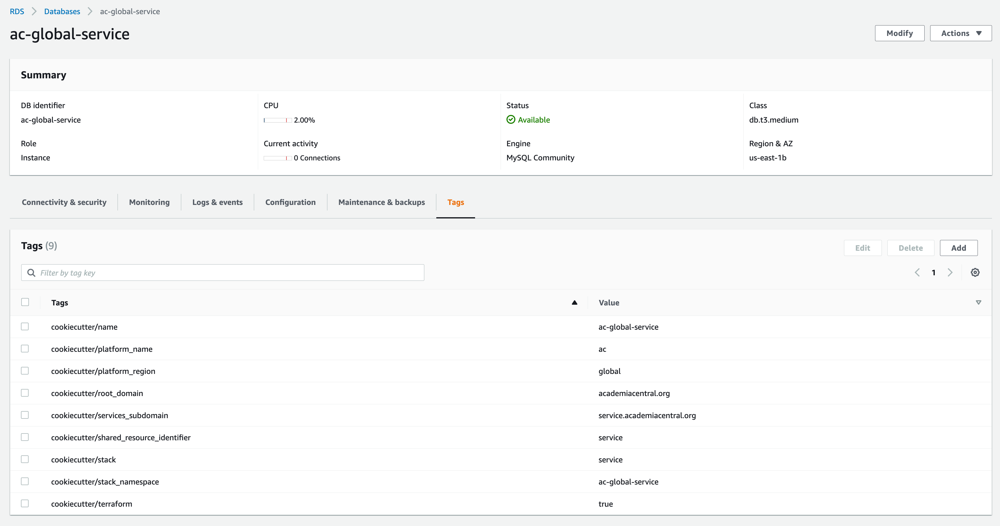

Project Generation Options
==========================

The cookiecutter provides nearly 150 configuration parameters, so there's a pretty good chance that you'll be able to generate a customized repo that exactly fits your needs.
We've also curated a set of sensible defaults for all of these options. If you're just getting started then you might want to consider
initially running something similar to the following:

.. code-block:: shell

  cookiecutter --checkout main \
              --output-dir ./ \
              --overwrite-if-exists \
              --no-input \
              gh:lpm0073/cookiecutter-openedx-devops \
              global_aws_region=us-east-1 \
              global_account_id=ADD-YOUR-ACCOUNT-NUMBER \
              global_root_domain=ADD-YOUR-ROOT-DOMAIN \
              global_aws_route53_hosted_zone_id=ADD-YOUR-HOSTED-ZONE-ID \

After reviewing the cookiecutter's initial outut you'll quickly get a general idea of what additional options you want to add to this basic pattern in order to acheive your desired results.

Project Identifiers
-------------------

These parameters identify high-level information about your Open edX installation.
Additionally, Terraform relies on `AWS resource tags <https://docs.aws.amazon.com/general/latest/gr/aws_tagging.html>`_ for programatically identifying and managing resources.
The Cookiecutter parameters that follow, in addition to identifying your AWS account and data center, will
also be used to generate the common sets of AWS resource tags that are used for programatic identification of all of the resources that Terraform creates for your Open edX platform.
See this example screen shot of a typical AWS resource. In this case, an AWS RDS MySQL server instance:

- **github_account_name:**

  The Github organization for the source cookiecutter (ie this repository).
  This is a command-line option only and is will not otherwise be sound in this
  sourcecode.

  *default value: lpm0073*

- **github_repo_name:**

  The Github repository for the source cookiecutter (ie this repository).
  This is a command-line option only and is will not otherwise be sound in this
  sourcecode.

  *default value: openedx_devops*

- **environment_name:**

  This cookiecutter will create one Open edX deployment environment for you,
  named environment_name and located in the file path ./terraform/environments/environment_name.
  You'll find extensive references to environment_name throughout ./terraform/environments/modules.
  Note that you can copy-paste this folder to create additional environments.

  *default value: prod*

- **environment_subdomain:**

  This cookiecutter will create several URL endpoints for each environment_name, with
  each endpoint residing inside a common subdomain named environment_subdomain.

  *default value: courses*

- **environment_studio_subdomain:**

  The subdomain name to use for the Open edX Course Management Studio URL endpoint.
  *default value: studio*

- **global_platform_name:**

  This is a global variable, stored in ./terraform/glocal.hcl that is ysed for creating
  the standardized naming identifiers in AWS resources and resource tags. You'll also
  find references to global_platform_name in the pre-configured helper bash scripts and the
  Kubernetes ingress manifests. global_platform_name is a short description identifying the Open edX platform that this
  cookiecutter will ultimately deploy, typically this is the root domain name for the project.

  *default value: yourschool*

- **global_platform_region:**

  This is a global variable, stored in ./terraform/glocal.hcl that is ysed for creating
  the standardized naming identifiers in AWS resources and resource tags. You'll also
  find references to global_platform_name in the pre-configured helper bash scripts and the
  Kubernetes ingress manifests. global_platform_region is a short description identifying the
  geographic area that this Open edX installation will serve. This value is nearly always set
  to the value 'global', meaning that this is the sole platform and it serves a global audience.

  *default value: global*

- **global_platform_shared_resource_identifier:**

  This is a stack variable, stored in ./terraform/stacks/global_platform_shared_resource_identifier/stack.hcl that is ysed for creating
  the standardized naming identifiers in AWS resources and resource tags. You'll also
  find references to global_platform_shared_resource_identifier in the pre-configured helper bash scripts and the
  Terragrunt templates. global_platform_shared_resource_identifier is a short description identifying the
  name of the shared collection of AWS resources that support one or more Open edX environments. You'll see this identifier
  as a suffix to the AWS resource tag names of resources like AWS VPC, AWS EKS, AWS RDS MySQL, MongoDB, and Elasticache.

  *default value: service*

- **global_services_subdomain:**

  This cookiecutter will create several URL endpoints for each stack service, with
  each endpoint residing inside a common subdomain named global_services_subdomain.
  Examples include mysql.global_services_subdomain, mongodb.global_services_subdomain, redis.global_services_subdomain.

  *default value:  same as global_platform_shared_resource_identifier*

- **global_root_domain:**

  The fully-qualified domain name that will contain **ALL* URL endpoints. Example: yourschool.edu

- **global_aws_route53_hosted_zone_id:**

  The AWS Route53 Hosted Zone ID of the global_root_domain.
  Cookiecutter assumes that DNS is managed by AWS Route53. Note however that you can still use this cookiecutter
  even if you manage your DNS for the global_root_domain elsewhere. But, in either case you'll need to create a
  Route53 hosted zone for the global_root_domain which Terraform will reference when created additional hosted zones
  for the environment and stack subdomains.

  *Example: Z08529743UBLZ51RJDD76*

- **global_aws_region:**

  The `3-part character code <https://docs.aws.amazon.com/AWSEC2/latest/UserGuide/using-regions-availability-zones.html#concepts-available-regions>`_ for
  the AWS data center in which you'll deploy all AWS resources. You should choose the data center that is physically
  located nearest your learners.

  *default value: us-east-1*

- **global_account_id:**

  Your 12-character AWS account number.

  *Example: 123456789012*

- **global_platform_description:**

  The value assigned to edx-platform Django settings variable PLATFORM_DESCRIPTION.

  *default value: Your School*

- **global_platform_logo_url:**

  Future use.

  *default value: https://www.edx.org/images/logos/edx-logo-elm.svg*

Cookiecutter AWS Services Stack Installation Options
----------------------------------------------------

- **stack_install_k8s_dashboard:**

  'Y' to install `Kubernetes Dashboard <https://kubernetes.io/docs/tasks/access-application-cluster/web-ui-dashboard/>`_
  in the AWS EKS cluster and add an ingress, ssl-tls cert and url endpoint to global_services_subdomain.

  Dashboard is a web-based Kubernetes user interface. You can use Dashboard to deploy containerized applications to a Kubernetes cluster, troubleshoot your containerized application, and manage the cluster resources. You can use Dashboard to get an overview of applications running on your cluster, as well as for creating or modifying individual Kubernetes resources (such as Deployments, Jobs, DaemonSets, etc). For example, you can scale a Deployment, initiate a rolling update, restart a pod or deploy new applications using a deploy wizard.

  *default value: Y*

- **stack_install_k8s_kubeapps:**

  'Y' to install `VMWare Bitnami Kubeapps <https://kubeapps.dev/>`_
  in the AWS EKS cluster and add an ingress, ssl-tls cert and url endpoint to global_services_subdomain.

  Kubeapps is an in-cluster web-based application that enables users with a one-time installation to deploy, manage, and upgrade applications on a Kubernetes cluster

  *default value: Y*

- **stack_install_k8s_karpenter:**

  'Y' to install `Karpenter <https://karpenter.sh/>`_ in the AWS EKS cluster.

  Karpenter is an open-source project lead by AWS that provides just-in-time compute nodes for any Kubernetes cluster.
  Karpenter simplifies Kubernetes infrastructure with the right nodes at the right time.
  Karpenter automatically launches just the right compute resources to handle your cluster's applications. It is designed to let you take full advantage of the cloud with fast and simple compute provisioning for Kubernetes clusters.

  *default value: Y*

- **stack_install_k8s_prometheus:**

  'Y' to install `Prometheus <https://prometheus.io/`_ in the AWS EKS cluster. This is required if you chose
  to install Karpenter.

  *default value: Y*

- **stack_add_remote_mongodb:**

  'Y' to create an EC2 instance-based MongoDB server. This is recommended because we have encountered occasional compatibility issues with
  AWS DocumentDB.

  *default value: Y*

- **stack_add_bastion:**

  'Y' to create an EC2 instance-based Bastion server. This is strongly recommended. The bastion server provides an ssh private key based entry point to
  services that are only accessible from within your AWS Virtual Private Cloud (VPC). Additionally, the bastion server contains a curated collection of
  preinstalled and preconfigured software that you'll need for administering your Open edX installation.

  This option is required if you choose Y to stack_add_bastion_openedx_dev_environment.

  The bastion server provides several important software packages, some of which involve non-trivial configuration
  that might otherwise be challenging for you to install on your own:

  - homebrew
  - helm
  - Docker
  - tutor
  - aws cli
  - kubectl
  - k9s
  - terraform and terragrunt
  - mysql client software
  - mongodb client software

  *default value: Y*

- **stack_add_bastion_openedx_dev_environment:**

  'Y' to include Open edX development essentials in the bastion configuration. These include for example:

  - a version of Python that exactly matches that of your Open edX deployments
  - building a matching Python virtual environment
  - including the apt packages that are requirements of the the PyPi packages included in the Python virtual environment.

  *default value: N*

Cookiecutter AWS Services Stack Configuration Options
-----------------------------------------------------

AWS Elastics Kubernetes Service Configuration Options
~~~~~~~~~~~~~~~~~~~~~~~~~~~~~~~~~~~~~~~~~~~~~~~~~~~~~

- **kubernetes_cluster_version:**

  The `Kubernetes version release <https://kubernetes.io/releases/`_ to use when creating the AWS EKS cluster. We choose this value carefully
  and we don't change it until we're absolutely certain that we, the maintainers of this repository, fully understand
  the implications of the change.

  **BE AWARE:** there are far-reaching and often times irreversible consequences to changing this value.
  DO NOT change this value unless you're certain that you understand whaat you're doing.

  *default value: 1.24*

- **eks_create_kms_key:**

  'Y' if you want to add an AWS KMS key to your AWS EKS cluster. A KMS key is used for encrypting Kubernetes Secrets
  in an AWS EKS cluster. In most cases this is unnecesary since access to the secrets first requires access to the cluster,
  which itself is already limited. The ecrypted secrets option is therefore disabled by default.
  Note that setting this value to 'Y' will effectively limit Terraform programatic access to the cluster to
  the IAM user who creates the cluster. Thereon you'll need to explicitly add additional
  permitted IAM users manually by editing the Terraform variable kms_key_owners in ./terraform/stacks/modules/kubernets/main.tf .

  *default value: Y*

The Karpenter node group is created for you automatically and is the default node group for the cluster.
Karpenter nodes use spot-pricing which varies based on market conditions but is typically around 1/3 the cost
of the same instance type's on-demand price. Note that spot-priced EC2 instances are effectively rented from
their rightful 'owner' and can be called back into service by the 'owner' at any time. Karpenter manages this process
for you, immediately replacing any node that is called back by its owner. This happens infrequently, with the exception of the eu-west-2 (London)
AWS data center.

- **eks_karpenter_group_instance_type:**

  The *preferred* instance type that Karpenter will acquire on your behalf from the spot-price marketplace. Note
  that the Terraform scripts include several fallback options in the event that your preferred instance type is not
  available.

  *default value: t3.large*

- **eks_karpenter_group_min_size:**

  The minimum number of EC2 instance compute nodes to maintain inside the compute plane of your cluster. This value
  needs to be at least 1 in order for Karpenter to gather real-time load and performance metrics that it uses
  for node auto scaling decisions. Also, note that most AWS data centers maintain 3 physical availability zones,
  which is the origin of this parameter's default value of 3. Also of note is that 3 spot-priced EC2 instances cost
  around the same amount of money as a single equivalent on-demand priced EC2 instance.

  *default value: 3*

- **eks_karpenter_group_max_size:**

  The maximum number of EC2 instances that Karpenter is permitted to add to the Kubernetes compute plane
  regardless of real-time load metrics.

  **BE AWARE** that misconfigured pods can lead to unbounded node scaling, which in turn would
  result in an unbounded AWS invoice at the end of the billing period, leading to a potentially
  unwelcome career change on your part :O

  *default value:  10*

- **eks_karpenter_group_desired_size:**

  The initial setting that Karpenter will use when the EKS cluster is created and initialized.
  This value will poentially change (higher or lower) as soon as metrics-server and promethus
  service begin reporting performance metrics to Karpenter.

  *default value: 3*

eks_worker_group is an optional, supplemental EC2 node worker group that is included in the
AWS EKS build. If you chose to install Karpenter then you can ignore these options.
Nodes created in this group will use on-demand pricing, which will cost around 3x as compared
to the Karpenter nodes, which use spot-pricing. However, availability of on-demand nodes is guaranteed by AWS.

- **eks_worker_group_min_size:**
  The minimum allowed quanity of nodes for this group.

  *default value: 0*

- **eks_worker_group_max_size:**
  The maximum allowed quanity of nodes for this group.

  *default value: 0*

- **eks_worker_group_desired_size:**
  The current run-time requested quanity of nodes for this group.

  *default value: 0*

- **eks_worker_group_instance_type:**
  The AWS EC2 instance type that will be created for all nodes in this group.

  *default value: t3.xlarge*

MongoDB Configuration Options
~~~~~~~~~~~~~~~~~~~~~~~~~~~~~

- **mongodb_instance_type:**
  The EC2 instance type to use when creating the MongoDB server.

  *default value: t3.medium*

- **mongodb_allocated_storage:**
  Note that the remote MongoDB relies on an AWS EBS
  drive volume that is separately managed by a different Terraform module. This
  will enable you to, for example, recreate the MongoDB EC2 instance as needed
  while not endangering the MongoDB data contents.

  **BE AWARE** changing this value later on will result in Terraform attempting
  to destroy and recreate the EBS volume which likely is **not** what you want. As a
  safeguard against this possibility, the Terraform script's "destroy" action will result
  in a Terraform run-time error. That is, you'll need to manually destroy the EBS volume
  using the AWS web console.

  *default value: 10*

AWS EC2 Bastion Server Configuration Options
~~~~~~~~~~~~~~~~~~~~~~~~~~~~~~~~~~~~~~~~~~~~

- **bastion_instance_type:**

  The AWS EC2 instance type to use when creating the bastion server.

  *default value: t3.micro*

- **bastion_allocated_storage:**

  The size of the EBS volume for the bastion server. Make sure to provide adequate
  storage for all of the software that is pre-installed, plus, to allow reasonable
  Docker caching space. Docker caching consumes a LOT of drive space btw.

  *default value: 50*

AWS RDS MySQL Server Configuration Options
~~~~~~~~~~~~~~~~~~~~~~~~~~~~~~~~~~~~~~~~~~

Note that the MySQL engine version parameters are carefully chosen to exactly match
Open edX's recommended configuration. Change these values at your own risk.

- **mysql_instance_class:**

  The AWS RDS instance size for the single instance created by the
  Terraform stack. Note that RDS service can safely vertically scale-descale
  your instance size after its been initially created.

  *default value: db.t2.small*

  Some rules of thumb on instance size:

  - during pre-producion: db.t2.small
  - less than 1,000 learners: db.t2.medium
  - up to 5,000 learners: db.t2.large
  - up to 25,000 learners: db.t2.xlarge
  - up to 100,000 learners: db.t2.2xlarge

- **mysql_allocated_storage:**

  The allocated MySQL EBS storage volume size. Note that AWS RDS determines your
  `"burst balance" <https://aws.amazon.com/blogs/database/understanding-burst-vs-baseline-performance-with-amazon-rds-and-gp2/>`_
  largely based on the size of the EBS drive volume that is attached to the RDS instance.

  *default value: 10*

- **mysql_username:**

  *default value: root*

- **mysql_port:**

  *default value: 3306*

- **mysql_engine:**

  *default value: mysql*

- **mysql_family:**

  *default value: mysql5.7*

- **mysql_major_engine_version:**

  *default value: 5.7*

- **mysql_engine_version:**

  *default value: 5.7.33*

- **mysql_create_random_password:**

  *default value: true*

- **mysql_iam_database_authentication_enabled:**

  *default value: false*

- **mysql_maintenance_window:**

  *default value: Sun:00:00-Sun:03:00*

- **mysql_backup_window:**

  *default value: 03:00-06:00*

- **mysql_backup_retention_period:**

  *default value: 7*

- **mysql_deletion_protection:**

  *default value: false*

- **mysql_skip_final_snapshot:**

  *default value: true*

AWS Elasticache Redis Cluster Configuration Options
~~~~~~~~~~~~~~~~~~~~~~~~~~~~~~~~~~~~~~~~~~~~~~~~~~~

These configuration values have been carefully selected by on
Open edX's configuration recommendations. These settings are known
to work well on installations supporting as many as 250,000 enrolled
learners.

- **redis_engine_version:**

  *default value: 6.x*

- **redis_num_cache_clusters:**

  *default value: 1*

- **redis_node_type:**

  *default value: cache.t2.small*

- **redis_port:**

  *default value: 6379*

- **redis_family:**

  *default value: redis6.x*

Cookiecutter Terraform Options
--------------------------------------------------

Terraform is an open-source infrastructure-as-code software tool created by HashiCorp.
Users define, implement and manage cloud data center infrastructure using a declarative configuration language known as HashiCorp Configuration Language (HCL).
Terraform is an extensible automation technology with a vibrant community-support ecosystem of various providers and modules.

Cookiecutter leverages open source providers and modules authored by Terraform, AWS and Helm.
We carefully vetted the libraries that we've added to the cookiecutter. Some of these libraries, the Kubernetes libraries in particular, evolve rapidly and sometimes include breaking changes.
These version settings are therefore of particular interest because the default version setting that we publish are know to
work together. Cookiecutter releases represent points in time in which various combinations of these version where known to work.

So, noting that testing these new library versions is time consuming, and for the benefit of the Cookiecutter community, please make pull requests to this repo to suggest new Terraform provider and/or module versions that you successfully test.

- **terraform_required_version:** ~> 1.3
- **terraform_aws_modules_acm:** ~> 4.3
- **terraform_aws_modules_cloudfront:** ~> 3.1
- **terraform_aws_modules_eks:** ~> 19.4
- **terraform_aws_modules_iam:** ~> 5.9
- **terraform_aws_modules_iam_assumable_role_with_oidc:** ~> 5.10
- **terraform_aws_modules_rds:** ~> 5.2
- **terraform_aws_modules_s3:** ~> 3.6
- **terraform_aws_modules_sg:** ~> 4.16
- **terraform_aws_modules_vpc:** ~> 3.18
- **terraform_helm_cert_manager:** ~> 1.10
- **terraform_helm_ingress_nginx_controller:** ~> 4.4
- **terraform_helm_vertical_pod_autoscaler:** ~> 6.0
- **terraform_helm_karpenter:** ~> 0.16
- **terraform_helm_dashboard:** ~> 6.0
- **terraform_helm_kubeapps:** latest
- **terraform_helm_metrics_server:** ~> 3.8
- **terraform_helm_prometheus:** ~> 43
- **terraform_provider_kubernetes_version:** ~> 2.16
- **terraform_provider_hashicorp_aws_version:** ~> 4.48
- **terraform_provider_hashicorp_local_version:** ~> 2.2
- **terraform_provider_hashicorp_random_version:** ~> 3.4
- **terraform_provider_hashicorp_kubectl_version:** ~> 1.14
- **terraform_provider_hashicorp_helm_version:** ~> 2.8

Cookiecutter Github Actions Options
-----------------------------------

GitHub Actions is a continuous integration and continuous delivery (CI/CD) platform that allows you to automate your build, test, and deployment pipeline. You can create workflows that build and test every pull request to your repository, or deploy merged pull requests to production.

GitHub Actions goes beyond just DevOps and lets you run workflows when other events happen in your repository. For example, you can run a workflow to automatically add the appropriate labels whenever someone creates a new issue in your repository.

GitHub provides Linux, Windows, and macOS virtual machines to run your workflows, or you can host your own self-hosted runners in your own data center or cloud infrastructure.

In 2022 Cookiecutter refactored the logic of its automated build and deploy workflows into a collection of Github Actions Components named `Open edX Github Actions <https://github.com/openedx-actions>`_.
Importantly, this has allowed the community to separately manage the evolution and code maintainance of the specifics of building and deploying Open edX software.
This is turn has greatly reduced the need to modify the Cookiecutter codebase while simultaneously leading to build and deploy workflows that are easier to read and to maintain, and are a lot easier to customize.

Open edX Build Options
~~~~~~~~~~~~~~~~~~~~~~

These options are mostly placeholders for Open edX container build scaffolding. You likely intend to
include a custom theme, one or more custom openedx plugins, one or more XBlocks, and any number of additional Python requirements.
The scaffolding that is generated by Cookiecutter provides the code samples that you need to get started in customizing your build.

- **ci_build_tutor_version:**

  Aside from the eventual customized contents of your openedx build, the specific version of
  `Tutor <https://docs.tutor.overhang.io/>`_ that you choose for managing the build process will potentially bear signficantly on how well things work.
  The default value that we maintain is known to work, whereas any other version might produce undesired results.

  *default value: 14.2.3*

- **ci_build_kubectl_version:**

  `kubectl <https://kubernetes.io/docs/tasks/tools/>`_ is the defacto Kubernetes command-line interface and the
  singular tool at your disposal for programatically administering your Kubernetes cluster. Your choice of `kubectl <https://kubernetes.io/docs/tasks/tools/>`_ version (and its installation method) have an equally significan impact to
  the reliability of your deploy workflows.

  *default value: 1.24/stable*

- **ci_build_theme_repository:**

  *default value: edx-theme-example*
- **ci_build_theme_repository_organization:**

  *default value: lpm0073*

- **ci_build_theme_ref:**

  *default value: main*

- **ci_build_plugin_org:**

  *default value: lpm0073*

- **ci_build_plugin_repository:**

  *default value: openedx-plugin-example*

- **ci_build_plugin_ref:**

  *default value: main*

- **ci_build_xblock_org:**

  *default value: openedx*

- **ci_build_xblock_repository:**

  *default value: edx-ora2*

- **ci_build_xblock_ref:**

  *default value: master*

Open edX Deployment
~~~~~~~~~~~~~~~~~~~~~~~

- **ci_openedx_actions_tutor_print_dump:**

  prints a complete dump to the Gihub Actions console of ubuntu environment variables, saved tutor config settings, and python requirements added.

  *default value: v1.0.0*

- **ci_deploy_open_edx_version:**

  The Open edX release version for your deployment. This is the single most consequential choice amongst the long list of Cookiecutter options.

  *default value: nutmeg.2*

- **ci_deploy_install_credentials_server:**

  'Y' to install the `Open edX Credentials service <https://github.com/openedx/credentials>`_

  *default value: N*

- **ci_deploy_install_discovery_service:**

  'Y' to install the `Open edX Course Discovery service <https://github.com/openedx/course-discovery>`_

  *default value: Y*

- **ci_deploy_install_mfe_service:**

  'Y' to install the `Open edX MFE service <https://github.com/overhangio/tutor-mfe>`_

  *default value: Y*

- **ci_deploy_install_notes_service:**

  'Y' to install the `Open edX Notes service <https://github.com/openedx/edx-notes-api>`_

  *default value: Y*

- **ci_deploy_install_ecommerce_service:**

  'Y' to install the `Open edX E-commerce service <https://github.com/openedx/ecommerce>`_

  *default value: N*

- **ci_deploy_install_forum_service:**

  'Y' to install the `Open edX Discussion Forum service <https://github.com/openedx/edx-platform>`_

  *default value: N*

- **ci_deploy_install_xqueue_service:**

  'Y' to install the `Open edX XQueue service <https://github.com/openedx/edx-platform>`_. Choose 'N' if you're unfamiliar with this service.

  *default value: N*

- **ci_deploy_install_license_manager_service:**

  'Y' to install the `Open edX License Manager service <https://github.com/openedx/license-manager>`_.

  *default value: N*

Cookiecutter Github Actions Configuration Options
-------------------------------------------------

Run-time Environment Options
~~~~~~~~~~~~~~~~~~~~~~~~~~~~

- **ci_actions_setup_build_action_version:** v2.2.1
- **ci_actions_amazon_ecr_login_version:** v1.5.3
- **ci_actions_checkout_version:** v3.2.0
- **ci_actions_configure_aws_credentials_version:** v1.7.0

Kubernetes Secrets for Open edX
~~~~~~~~~~~~~~~~~~~~~~~~~~~~~~~

- **ci_openedx_actions_tutor_k8s_init_version:** v1.0.4
- **ci_openedx_actions_tutor_k8s_configure_autoscaling_version:** v0.0.1
- **ci_openedx_actions_tutor_k8s_configure_edx_secret_version:** v1.0.0
- **ci_openedx_actions_tutor_k8s_configure_edx_admin:** v1.0.1
- **ci_openedx_actions_tutor_k8s_configure_jwt_version:** v1.0.0
- **ci_openedx_actions_tutor_k8s_configure_mysql_version:** v1.0.2
- **ci_openedx_actions_tutor_k8s_configure_mongodb_version:** v1.0.1
- **ci_openedx_actions_tutor_k8s_configure_redis_version:** v1.0.0
- **ci_openedx_actions_tutor_k8s_configure_smtp_version:** v1.0.0

AWS ECR Build Actions
~~~~~~~~~~~~~~~~~~~~~

- **ci_openedx_actions_tutor_plugin_build_backup_version:** v0.1.7
- **ci_openedx_actions_tutor_plugin_build_credentials_version:** v1.0.0
- **ci_openedx_actions_tutor_plugin_build_license_manager_version:** v0.0.2
- **ci_openedx_actions_tutor_plugin_build_openedx_version:** v1.0.2
- **ci_openedx_actions_tutor_plugin_build_openedx_add_requirement_version:** v1.0.4
- **ci_openedx_actions_tutor_plugin_build_openedx_add_theme_version:** v1.0.0
- **ci_openedx_actions_tutor_plugin_configure_courseware_mfe_version:** v0.0.2

Open edX Deployment Feature Flags
~~~~~~~~~~~~~~~~~~~~~~~~~~~~~~~~~

- **ci_openedx_actions_tutor_plugin_enable_backup_version:** v0.0.10
- **ci_openedx_actions_tutor_plugin_enable_credentials_version:** v1.0.0
- **ci_openedx_actions_tutor_plugin_enable_discovery_version:** v1.0.0
- **ci_openedx_actions_tutor_plugin_enable_ecommerce_version:** v1.0.2
- **ci_openedx_actions_tutor_plugin_enable_forum_version:** v1.0.0
- **ci_openedx_actions_tutor_plugin_enable_k8s_deploy_tasks_version:** v0.0.1
- **ci_openedx_actions_tutor_plugin_enable_license_manager_version:** v0.0.3
- **ci_openedx_actions_tutor_plugin_enable_mfe_version:** v0.0.1
- **ci_openedx_actions_tutor_plugin_enable_notes_version:** v1.0.2
- **ci_openedx_actions_tutor_plugin_enable_s3_version:** v1.0.2
- **ci_openedx_actions_tutor_plugin_enable_xqueue_version:** v1.0.0
