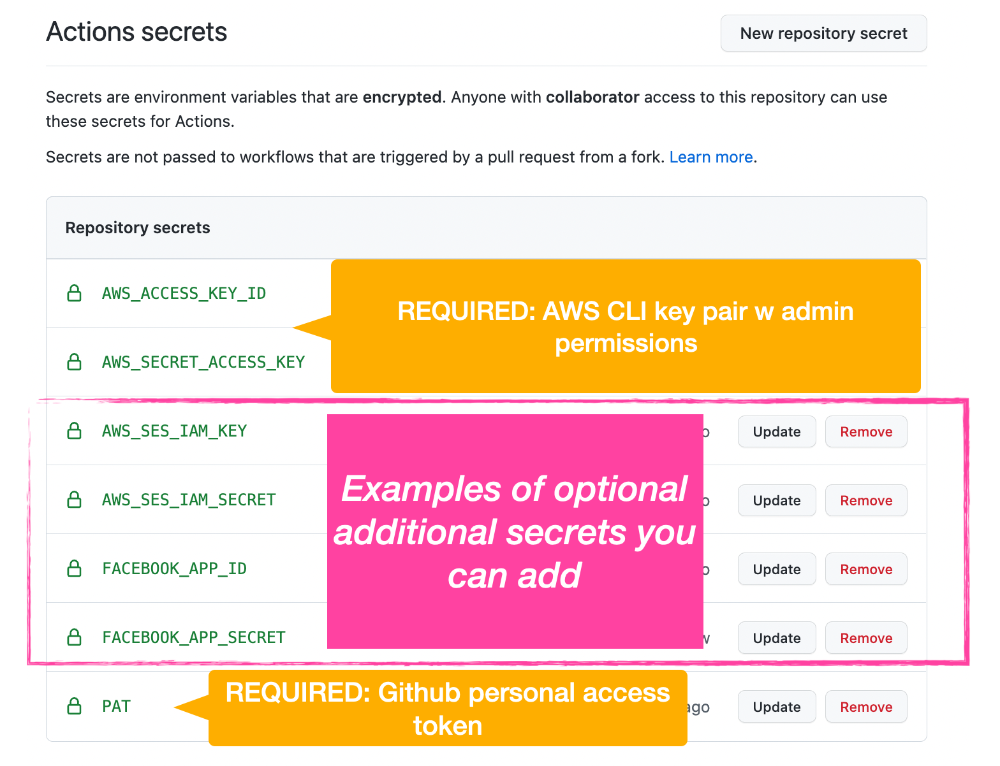
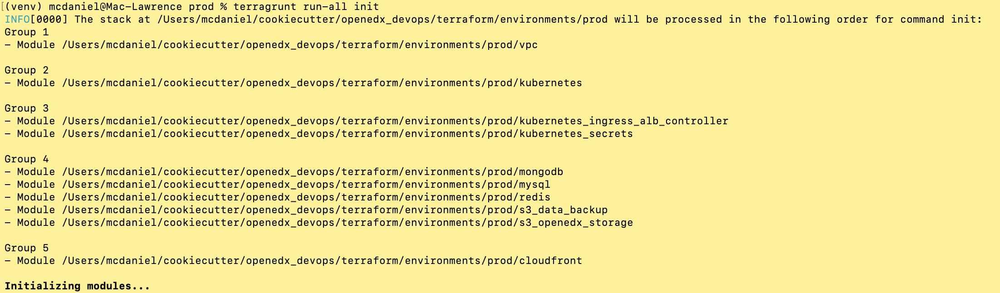
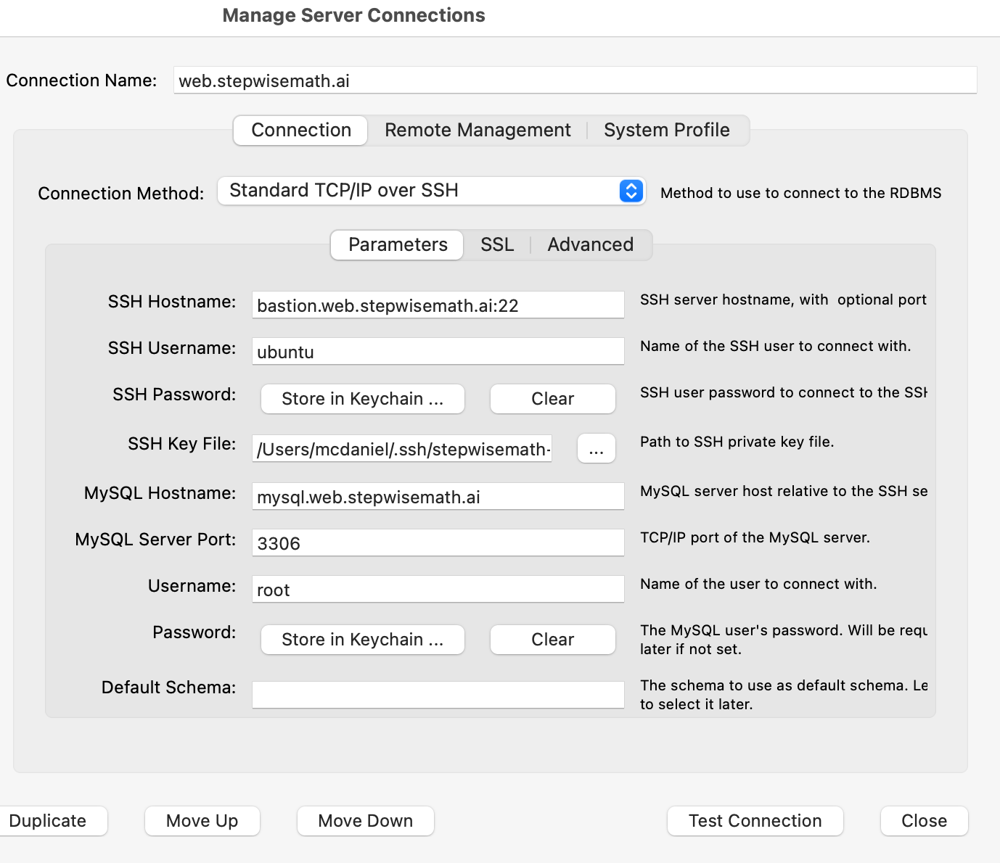

Tutor Open edX Production Devops Tools
======================================
.. image:: https://img.shields.io/badge/hack.d-Lawrence%20McDaniel-orange.svg
  :target: https://lawrencemcdaniel.com
  :alt: Hack.d Lawrence McDaniel

.. image:: https://img.shields.io/static/v1?logo=discourse&label=Forums&style=flat-square&color=ff0080&message=discuss.overhang.io
  :alt: Forums
  :target: https://discuss.openedx.org/

.. image:: https://img.shields.io/static/v1?logo=readthedocs&label=Documentation&style=flat-square&color=blue&message=docs.tutor.overhang.io
  :alt: Documentation
  :target: https://docs.tutor.overhang.io
|
.. image:: https://img.shields.io/badge/terraform-%235835CC.svg?style=for-the-badge&logo=terraform&logoColor=white
  :target: https://www.terraform.io/
  :alt: Terraform

.. image:: https://img.shields.io/badge/AWS-%23FF9900.svg?style=for-the-badge&logo=amazon-aws&logoColor=white
  :target: https://aws.amazon.com/
  :alt: AWS

.. image:: https://img.shields.io/badge/docker-%230db7ed.svg?style=for-the-badge&logo=docker&logoColor=white
  :target: https://www.docker.com/
  :alt: Docker

.. image:: https://img.shields.io/badge/kubernetes-%23326ce5.svg?style=for-the-badge&logo=kubernetes&logoColor=white
  :target: https://kubernetes.io/
  :alt: Kubernetes
|

.. image:: https://avatars.githubusercontent.com/u/40179672
  :target: https://openedx.org/
  :alt: OPEN edX
  :width: 75px
  :align: center

.. image:: https://overhang.io/static/img/tutor-logo.svg
  :target: https://docs.tutor.overhang.io/
  :alt: Tutor logo
  :width: 75px
  :align: center

|

This repository contains Terraform code and Github Actions workflows to deploy and manage a `Tutor <https://docs.tutor.overhang.io/>`_ Kubernetes-managed
production installation of Open edX that will automatically scale up, reliably supporting several hundred thousand learners.

Open edX Application Software Endpoints
---------------------------------------

- LMS: https://{{ cookiecutter.environment_subdomain }}.{{ cookiecutter.global_root_domain }}
- Course Management Studio: https://{{ cookiecutter.environment_studio_subdomain }}.{{ cookiecutter.environment_subdomain }}.{{ cookiecutter.global_root_domain }}
- **Content Delivery Network (CDN)**: https://cdn.{{ cookiecutter.environment_subdomain }}.{{ cookiecutter.global_root_domain }} linked to a public read-only S3 bucket named {{ cookiecutter.environment_subdomain }}-{{ cookiecutter.global_platform_name }}-{{ cookiecutter.global_platform_region }}-storage
- **AWS S3 Backups**: {{ cookiecutter.environment_name }}-{{ cookiecutter.global_platform_name }}-{{ cookiecutter.global_platform_region }}-backup.s3.amazonaws.com
- **AWS S3 Storage**: {{ cookiecutter.environment_name }}-{{ cookiecutter.global_platform_name }}-{{ cookiecutter.global_platform_region }}-storage.s3.amazonaws.com
- **AWS S3 Secrets**: {{ cookiecutter.environment_name }}-{{ cookiecutter.global_platform_name }}-{{ cookiecutter.global_platform_region }}-secrets.s3.amazonaws.com

Services Endpoints
------------------

- **Bastion**: bastion.{{ cookiecutter.global_services_subdomain }}.{{ cookiecutter.global_root_domain }}:22. Public ssh access to a {{ cookiecutter.bastion_instance_type }} Ubuntu 20.04 LTS bastion EC2 instance that's preconfigure with all of the software that you'll need to adminster this stack.
- **MySQL**: mysql.{{ cookiecutter.global_services_subdomain }}.{{ cookiecutter.global_root_domain }}:3306. Private VPC access to your AWS RDS MySQL {{ cookiecutter.mysql_instance_class }} instance with allocated storage of {{ cookiecutter.mysql_allocated_storage }}.
- **MongoDB**: mongodb.{{ cookiecutter.global_services_subdomain }}.{{ cookiecutter.global_root_domain }}:27017. Private VPC access to your EC2-based installation of MongoDB on a {{ cookiecutter.mongodb_instance_type }} instance with allocated storage of {{ cookiecutter.mongodb_allocated_storage }}.

- **Kubernetes Dashboard**: https://dashboard.{{ cookiecutter.global_services_subdomain }}.{{ cookiecutter.global_root_domain }}. Dashboard is a web-based Kubernetes user interface. You can use Dashboard to deploy containerized applications to a Kubernetes cluster, troubleshoot your containerized application, and manage the cluster resources. You can use Dashboard to get an overview of applications running on your cluster, as well as for creating or modifying individual Kubernetes resources (such as Deployments, Jobs, DaemonSets, etc). For example, you can scale a Deployment, initiate a rolling update, restart a pod or deploy new applications using a deploy wizard.


- **Kubeapps**: https://kubeapps.{{ cookiecutter.global_services_subdomain }}.{{ cookiecutter.global_root_domain }}. Kubeapps is an in-cluster web-based application that enables users with a one-time installation to deploy, manage, and upgrade applications on a Kubernetes cluster


- **Grafana**: https://grafana.{{ cookiecutter.global_services_subdomain }}.{{ cookiecutter.global_root_domain }}. Grafana is a multi-platform open source analytics and interactive visualization web application. It provides charts, graphs, and alerts for the web when connected to supported data sources.


You can also optionally automatically create additional environments for say, dev and test and QA and so forth.
These would result in environments like the following:

- LMS at https://dev.{{ cookiecutter.environment_subdomain }}.{{ cookiecutter.global_root_domain }}
- CMS at https://{{ cookiecutter.environment_studio_subdomain }}.dev.{{ cookiecutter.environment_subdomain }}-{{ cookiecutter.global_root_domain }}
- CDN at https://cdn.dev.{{ cookiecutter.environment_subdomain }}.{{ cookiecutter.global_root_domain }} linked to an S3 bucket named dev-{{ cookiecutter.global_platform_name }}-{{ cookiecutter.global_platform_region }}-storage
- daily data backups archived into an S3 bucket named dev-{{ cookiecutter.global_platform_name }}-{{ cookiecutter.global_platform_region }}-mongodb-backup

New Features
------------

**NEW IN VERSION 1.0.2: SPOT PRICING FOR EC2 INSTANCES** Save up to 75% off the cost of on-demand EC2 instances by using AWS' flexible `spot-pricing <https://aws.amazon.com/ec2/spot/pricing/>`_ .

**NEW IN VERSION 1.0.3:** an optional fully-configured remote MongoDB server running on an EC2 instance. Set cookiecutter.stack_add_remote_mongodb=Y to choose this option.

**NEW IN VERSION 1.0.5:** Kubernetes upgrade to 1.24, plus a new adminstrative server with all of the preinstalled software that you'll need to administer your Open edX platform. Set cookiecutter.stack_add_bastion=Y to choose this option.

**NEW IN VERSION 1.0.8:** `Kubernetes Dashboard <https://kubernetes.io/docs/tasks/access-application-cluster/web-ui-dashboard/>`_ and `Kubeapps <https://kubeapps.dev/>`_ web applications.

Cookiecutter Manifest
---------------------

This repository was generated using `Cookiecutter <https://cookiecutter.readthedocs.io/>`_. Keep your repository up to date with the latest Terraform code and configuration versions of the Open edX application stack, AWS infrastructure services and api code libraries by occasionally re-generating the Cookiecutter template using this `make file <./make.sh>`_.

.. list-table:: Cookiecutter Version Control
  :widths: 75 20
  :header-rows: 1

  * - Software
    - Version
  * - `Open edX Named Release <https://edx.readthedocs.io/projects/edx-developer-docs/en/latest/named_releases.html>`_
    - {{ cookiecutter.ci_deploy_open_edx_version }}
  * - `MySQL Server <https://www.mysql.com/>`_
    - {{ cookiecutter.mysql_engine_version }}
  * - `Redis Cache <https://redis.io/>`_
    - {{ cookiecutter.redis_engine_version }}
  * - `Tutor Docker-based Open edX Installer <https://docs.tutor.overhang.io/>`_
    - {{ cookiecutter.ci_build_tutor_version }}
  * - `Tutor Plugin: Object storage for Open edX with S3 <https://github.com/hastexo/tutor-contrib-s3>`_
    - {{ cookiecutter.ci_openedx_actions_tutor_plugin_enable_s3_version }}
  
  * - `Tutor Plugin: Backup & Restore <https://github.com/hastexo/tutor-contrib-backup>`_
    - {{ cookiecutter.ci_openedx_actions_tutor_plugin_build_backup_version }}
  
  
  * - `Tutor Plugin: Credentials Application <https://github.com/lpm0073/tutor-contrib-credentials>`_
    - {{ cookiecutter.ci_openedx_actions_tutor_plugin_enable_credentials_version }}
  
  * - `Tutor Plugin: Discovery Service <https://github.com/overhangio/tutor-discovery>`_
    - latest stable
  
  * - `Tutor Plugin: Micro Front-end Service <https://github.com/overhangio/tutor-mfe>`_
    - latest stable
  
  
  * - `Tutor Plugin: Ecommerce Service <https://github.com/overhangio/tutor-ecommerce>`_
    - latest stable
  
  
  * - `Tutor Plugin: Xqueue Service <https://github.com/overhangio/tutor-xqueue>`_
    - latest stable
  
  
  * - `Tutor Plugin: Notes Service <https://github.com/overhangio/tutor-notes>`_
    - latest stable
  
  
  * - `Tutor Plugin: Discussion Forum Service <https://github.com/overhangio/tutor-forum>`_
    - latest stable
  
  * - `Tutor Plugin: Android Application <https://github.com/overhangio/tutor-android>`_
    - latest stable
  * - `Kubernetes Cluster <https://kubernetes.io/>`_
    - {{ cookiecutter.kubernetes_cluster_version }}
  * - `Terraform <https://www.terraform.io/>`_
    - {{ cookiecutter.terraform_required_version }}
  * - Terraform Provider `Kubernetes <https://registry.terraform.io/providers/hashicorp/kubernetes/latest/docs>`_
    - {{ cookiecutter.terraform_provider_kubernetes_version }}
  * - Terraform Provider `kubectl <https://registry.terraform.io/providers/gavinbunney/kubectl/latest/docs>`_
    - {{ cookiecutter.terraform_provider_hashicorp_kubectl_version }}
  * - Terraform Provider `helm <https://registry.terraform.io/providers/hashicorp/helm/latest/docs>`_
    - {{ cookiecutter.terraform_provider_hashicorp_helm_version }}
  * - Terraform Provider `AWS <https://registry.terraform.io/providers/hashicorp/aws/latest/docs>`_
    - {{ cookiecutter.terraform_provider_hashicorp_aws_version }}
  * - Terraform Provider `Local <https://registry.terraform.io/providers/hashicorp/local/latest/docs>`_
    - {{ cookiecutter.terraform_provider_hashicorp_local_version }}
  * - Terraform Provider `Random <https://registry.terraform.io/providers/hashicorp/random/latest/docs>`_
    - {{ cookiecutter.terraform_provider_hashicorp_random_version }}
  * - `terraform-aws-modules/acm <https://registry.terraform.io/modules/terraform-aws-modules/acm/aws/latest>`_
    - {{ cookiecutter.terraform_aws_modules_acm }}
  * - `terraform-aws-modules/cloudfront <https://registry.terraform.io/modules/terraform-aws-modules/cloudfront/aws/latest>`_
    - {{ cookiecutter.terraform_aws_modules_cloudfront }}
  * - `terraform-aws-modules/eks <https://registry.terraform.io/modules/terraform-aws-modules/eks/aws/latest>`_
    - {{ cookiecutter.terraform_aws_modules_eks }}
  * - `terraform-aws-modules/iam <https://registry.terraform.io/modules/terraform-aws-modules/iam/aws/latest>`_
    - {{ cookiecutter.terraform_aws_modules_iam }}
  * - `terraform-aws-modules/rds <https://registry.terraform.io/modules/terraform-aws-modules/rds/aws/latest>`_
    - {{ cookiecutter.terraform_aws_modules_rds }}
  * - `terraform-aws-modules/s3-bucket <https://registry.terraform.io/modules/terraform-aws-modules/s3-bucket/aws/latest>`_
    - {{ cookiecutter.terraform_aws_modules_s3 }}
  * - `terraform-aws-modules/security-group <https://registry.terraform.io/modules/terraform-aws-modules/security-group/aws/latest>`_
    - {{ cookiecutter.terraform_aws_modules_sg }}
  * - `terraform-aws-modules/vpc <https://registry.terraform.io/modules/terraform-aws-modules/vpc/aws/latest>`_
    - {{ cookiecutter.terraform_aws_modules_vpc }}
  * - `Helm cert-manager <https://charts.jetstack.io>`_
    - {{ cookiecutter.terraform_helm_cert_manager }}
  * - `Helm Ingress Nginx Controller <https://kubernetes.github.io/ingress-nginx/>`_
    - {{ cookiecutter.terraform_helm_ingress_nginx_controller }}
  * - `Helm Vertical Pod Autoscaler <https://github.com/cowboysysop/charts/tree/master/charts/vertical-pod-autoscaler>`_
    - {{ cookiecutter.terraform_helm_vertical_pod_autoscaler }}
  * - `Helm Kubernetes Dashboard <https://kubernetes.github.io/dashboard/>`_
    - {{ cookiecutter.terraform_helm_dashboard }}
  * - `Helm kubeapps <https://bitnami.com/stack/kubeapps/helm>`_
    - {{ cookiecutter.terraform_helm_kubeapps }}
  * - `Helm Karpenter <https://artifacthub.io/packages/helm/karpenter/karpenter>`_
    - {{ cookiecutter.terraform_helm_karpenter }}
  * - `Helm Metrics Server <https://kubernetes-sigs.github.io/metrics-server/>`_
    - {{ cookiecutter.terraform_helm_metrics_server }}
  * - `Helm Prometheus <https://prometheus-community.github.io/helm-charts/>`_
    - {{ cookiecutter.terraform_helm_prometheus }}
  * - `openedx-actions/tutor-k8s-init <https://github.com/marketplace/actions/open-edx-tutor-k8s-init>`_
    - {{ cookiecutter.ci_openedx_actions_tutor_k8s_init_version }}
  * - `openedx-actions/tutor-k8s-configure-edx-secret <https://github.com/openedx-actions/tutor-k8s-configure-edx-secret>`_
    - {{ cookiecutter.ci_openedx_actions_tutor_k8s_configure_edx_secret_version }}
  * - `openedx-actions/tutor-k8s-configure-edx-admin <https://github.com/openedx-actions/tutor-k8s-configure-edx-admin>`_
    - {{ cookiecutter.ci_openedx_actions_tutor_k8s_configure_edx_admin }}
  * - `openedx-actions/tutor-k8s-configure-jwt <https://github.com/openedx-actions/tutor-k8s-configure-jwt>`_
    - {{ cookiecutter.ci_openedx_actions_tutor_k8s_configure_jwt_version }}
  * - `openedx-actions/tutor-k8s-configure-mysql <https://github.com/openedx-actions/tutor-k8s-configure-mysql>`_
    - {{ cookiecutter.ci_openedx_actions_tutor_k8s_configure_mysql_version }}
  * - `openedx-actions/tutor-k8s-configure-mongodb <https://github.com/openedx-actions/tutor-k8s-configure-mongodb>`_
    - {{ cookiecutter.ci_openedx_actions_tutor_k8s_configure_mongodb_version }}
  * - `openedx-actions/tutor-k8s-configure-redis <https://github.com/openedx-actions/tutor-k8s-configure-redis>`_
    - {{ cookiecutter.ci_openedx_actions_tutor_k8s_configure_redis_version }}
  * - `openedx-actions/tutor-k8s-configure-smtp <https://github.com/openedx-actions/tutor-k8s-configure-smtp>`_
    - {{ cookiecutter.ci_openedx_actions_tutor_k8s_configure_smtp_version }}
  * - `openedx-actions/tutor-print-dump <https://github.com/openedx-actions/tutor-print-dump>`_
    - {{ cookiecutter.ci_openedx_actions_tutor_print_dump }}
  * - `openedx-actions/tutor-plugin-build-backup <https://github.com/openedx-actions/tutor-plugin-build-backup>`_
    - {{ cookiecutter.ci_openedx_actions_tutor_plugin_build_backup_version }}
  * - `openedx-actions/tutor-plugin-build-credentials <https://github.com/openedx-actions/tutor-plugin-build-credentials>`_
    - {{ cookiecutter.ci_openedx_actions_tutor_plugin_build_credentials_version }}
  * - `openedx-actions/tutor-plugin-build-license-manager <https://github.com/openedx-actions/tutor-plugin-build-license-manager>`_
    - {{ cookiecutter.ci_openedx_actions_tutor_plugin_build_license_manager_version }}
  * - `openedx-actions/tutor-plugin-build-openedx <https://github.com/openedx-actions/tutor-plugin-build-openedx>`_
    - {{ cookiecutter.ci_openedx_actions_tutor_plugin_build_openedx_version }}
  * - `openedx-actions/tutor-plugin-build-openedx-add-requirement <https://github.com/openedx-actions/tutor-plugin-build-openedx-add-requirement>`_
    - {{ cookiecutter.ci_openedx_actions_tutor_plugin_build_openedx_add_requirement_version }}
  * - `openedx-actions/tutor-plugin-build-openedx-add-theme <https://github.com/openedx-actions/tutor-plugin-build-openedx-add-theme>`_
    - {{ cookiecutter.ci_openedx_actions_tutor_plugin_build_openedx_add_theme_version }}
  * - `openedx-actions/tutor-plugin-configure-courseware-mfe <https://github.com/openedx-actions/tutor-plugin-configure-courseware-mfe>`_
    - {{ cookiecutter.ci_openedx_actions_tutor_plugin_configure_courseware_mfe_version }}
  * - `openedx-actions/tutor-plugin-enable-backup <https://github.com/openedx-actions/tutor-plugin-enable-backup>`_
    - {{ cookiecutter.ci_openedx_actions_tutor_plugin_enable_backup_version }}
  * - `openedx-actions/tutor-plugin-enable-credentials <https://github.com/openedx-actions/tutor-plugin-enable-credentials>`_
    - {{ cookiecutter.ci_openedx_actions_tutor_plugin_enable_credentials_version }}
  * - `openedx-actions/tutor-plugin-enable-discovery <https://github.com/openedx-actions/tutor-plugin-enable-discovery>`_
    - {{ cookiecutter.ci_openedx_actions_tutor_plugin_enable_discovery_version }}
  * - `openedx-actions/tutor-plugin-enable-ecommerce <https://github.com/openedx-actions/tutor-plugin-enable-ecommerce>`_
    - {{ cookiecutter.ci_openedx_actions_tutor_plugin_enable_ecommerce_version }}
  * - `openedx-actions/tutor-plugin-enable-forum <https://github.com/openedx-actions/tutor-plugin-enable-forum>`_
    - {{ cookiecutter.ci_openedx_actions_tutor_plugin_enable_forum_version }}
  * - `openedx-actions/tutor-plugin-enable-k8s-deploy-tasks <https://github.com/openedx-actions/tutor-plugin-enable-k8s-deploy-tasks>`_
    - {{ cookiecutter.ci_openedx_actions_tutor_plugin_enable_k8s_deploy_tasks_version }}
  * - `openedx-actions/tutor-enable-plugin-license-manager <https://github.com/openedx-actions/tutor-enable-plugin-license-manager>`_
    - {{ cookiecutter.ci_openedx_actions_tutor_plugin_enable_license_manager_version }}
  * - `openedx-actions/tutor-plugin-enable-notes <https://github.com/openedx-actions/tutor-plugin-enable-notes>`_
    - {{ cookiecutter.ci_openedx_actions_tutor_plugin_enable_notes_version }}
  * - `openedx-actions/tutor-plugin-enable-s3 <https://github.com/openedx-actions/tutor-plugin-enable-s3>`_
    - {{ cookiecutter.ci_openedx_actions_tutor_plugin_enable_s3_version }}
  * - `openedx-actions/tutor-plugin-enable-xqueue <https://github.com/openedx-actions/tutor-plugin-enable-xqueue>`_
    - {{ cookiecutter.ci_openedx_actions_tutor_plugin_enable_xqueue_version }}

Important Considerations
------------------------

- this code only works for AWS.
- the root domain {{ cookiecutter.global_root_domain }} must be hosted in `AWS Route53 <https://console.aws.amazon.com/route53/v2/hostedzones#>`_. Terraform will create several DNS entries inside of this hosted zone, and it will optionally create additional hosted zones (one for each additional optional environment) that will be linked to the hosted zone of your root domain.
- resources are deployed to this AWS region: ``{{ cookiecutter.global_aws_region }}``
- the Github Actions workflows depend on secrets `located here <settings> (see 'secrets/actions' from the left menu bar) `_
- the Github Actions use an AWS IAM key pair from `this manually-created user named *ci* <https://console.aws.amazon.com/iam/home#/users/ci?section=security_credentials>`_
- the collection of resources created by these scripts **will generate AWS costs of around $0.41 USD per hour ($10.00 USD per day)** while the platform is in a mostly-idle pre-production state. This cost will grow proportionally to your production work loads. You can view your `AWS Billing dashboard here <https://console.aws.amazon.com/billing/home?region={{ cookiecutter.global_aws_region }}#/>`_
- **BE ADVISED** that `MySQL RDS <https://{{ cookiecutter.global_aws_region }}.console.aws.amazon.com/rds/home?region={{ cookiecutter.global_aws_region }}#databases:>`_, `MongoDB <https://{{ cookiecutter.global_aws_region }}.console.aws.amazon.com/docdb/home?region={{ cookiecutter.global_aws_region }}#subnetGroups>`_ and `Redis ElastiCache <https://{{ cookiecutter.global_aws_region }}.console.aws.amazon.com/elasticache/home?region={{ cookiecutter.global_aws_region }}#redis:>`_ are vertically scaled **manually** and therefore require some insight and potential adjustments on your part. All of these services are defaulted to their minimum instance sizes which you can modify in the `environment configuration file <terraform/environments/{{ cookiecutter.environment_name }}/env.hcl>`_

Quick Start
-----------

I. Add Your Secret Credentials To This Repository
~~~~~~~~~~~~~~~~~~~~~~~~~~~~~~~~~~~~~~~~~~~~~~~~~

The Github Actions workflows in this repository depend on several `workflow secrets <settings>`_ including two sets of AWS IAM keypairs, one for CI workflows and another for the AWS Simple Email Service.
Additionally, they require a Github Personal Access Token (PAT) for a Github user account with all requisite privileges in this repository as well as any other repositories that are cloned during any of the build / installation pipelines.

II. Configure Your Open edX Back End
~~~~~~~~~~~~~~~~~~~~~~~~~~~~~~~~~~~~

Set your `global parameters <terraform/environments/global.hcl>`_

.. code-block:: hcl

  locals {
    platform_name    = "{{ cookiecutter.global_platform_name }}"
    platform_region  = "{{ cookiecutter.global_platform_region }}"
    root_domain      = "{{ cookiecutter.global_root_domain }}"
    aws_region       = "{{ cookiecutter.global_aws_region }}"
    account_id       = "{{ cookiecutter.global_account_id }}"
  }

Set your `production environment parameters <terraform/environments/{{ cookiecutter.environment_name }}/env.hcl>`_

.. code-block:: hcl

  locals {

  environment           = "{{ cookiecutter.environment_subdomain }}"
  environment_domain    = "${local.environment}.${local.global_vars.locals.root_domain}"
  environment_namespace = "${local.environment}-${local.global_vars.locals.platform_name}-${local.global_vars.locals.platform_region}"

  # AWS infrastructure sizing

  mysql_instance_class            = "{{ cookiecutter.mysql_instance_class }}"
  redis_node_type                 = "{{ cookiecutter.redis_node_type }}"
  eks_worker_group_instance_type  = "{{ cookiecutter.eks_worker_group_instance_type }}"

  }

III. Build Your Open edX Backend
~~~~~~~~~~~~~~~~~~~~~~~~~~~~~~~~

The backend build procedure is automated using `Terragrunt <https://terragrunt.gruntwork.io/>`_ for `Terraform <https://www.terraform.io/>`_.
Installation instructions are avilable at both of these web sites.

Terraform scripts rely on the `AWS CLI (Command Line Interface) Tools <https://aws.amazon.com/cli/>`_. Installation instructions for Windows, macOS and Linux are available on this site.
We also recommend that you install `k9s <https://k9scli.io/>`_, a popular tool for adminstering a Kubernetes cluster.

.. code-block:: shell

  # -------------------------------------
  # to build the entire backend
  # -------------------------------------
  cd ./terraform/environments/{{ cookiecutter.environment_name }}/vpc
  terragrunt run-all init
  terragrunt run-all apply

  # -------------------------------------
  # or, to manage an individual resource
  # -------------------------------------
  cd ./terraform/environments/{{ cookiecutter.environment_name }}/mongodb
  terragrunt init
  terragrunt validate
  terragrunt plan
  terragrunt apply
  terragrunt destroy

IV. Connect To Your backend Services
~~~~~~~~~~~~~~~~~~~~~~~~~~~~~~~~~~~~

Terraform creates friendly subdomain names for any of the backend services which you are likely to connect: Cloudfront, MySQL, Mongo and Redis.
The ssh private pem key for accessing the EC2 Bastion instance is stored in Kubernetes secrets in the openedx namespace. Additionally, passwords for the root/admin accounts are accessible from Kubernetes Secrets. Note that each of MySQL, MongoDB and Redis reside in private subnets. These services can only be accessed on the command line from the Bastion.

.. code-block:: shell

  ssh bastion.{{ cookiecutter.environment_subdomain }}.{{ cookiecutter.global_root_domain }} -i path/to/{{ cookiecutter.global_platform_name }}-{{ cookiecutter.global_platform_region }}-{{ cookiecutter.global_platform_shared_resource_identifier }}-bastion.pem

  mysql -h mysql.{{ cookiecutter.environment_subdomain }}.{{ cookiecutter.global_root_domain }} -u root -p

  mongo --port 27017 --host mongo.master.{{ cookiecutter.environment_subdomain }}.{{ cookiecutter.global_root_domain }} -u root -p
  mongo --port 27017 --host mongo.reader.{{ cookiecutter.environment_subdomain }}.{{ cookiecutter.global_root_domain }} -u root -p

  redis-cli -h redis.primary.{{ cookiecutter.environment_subdomain }}.{{ cookiecutter.global_root_domain }} -p 6379

Specifically with regard to MySQL, several 3rd party analytics tools provide out-of-the-box connectivity to MySQL via a bastion server. Following is an example of how to connect to your MySQL environment using MySQL Workbench.

V. Manage your new Kubernetes cluster
~~~~~~~~~~~~~~~~~~~~~~~~~~~~~~~~~~~~~

Installs four of the most popular web applications:

- `k9s <https://k9scli.io/>`_, preinstalled in the optional EC2 Bastion server. K9s is an amazing retro styled, ascii-based UI for viewing and monitoring all aspects of your Kubernetes cluster. It looks and runs great from any ssh-connected terminal window.
- `Kubernetes Dashboard <https://kubernetes.io/docs/tasks/access-application-cluster/web-ui-dashboard/>`_ at https://dashboard.{{ cookiecutter.global_services_subdomain }}.{{ cookiecutter.global_root_domain }}. Written by the same team that maintain Kubernetes, Kubernetes Dashboard provides an elegant web UI for monitoring and administering your kubernetes cluster.
- `Kubeapps <https://kubeapps.dev/>`_ at https://kubeapps.{{ cookiecutter.global_services_subdomain }}.{{ cookiecutter.global_root_domain }}. Maintained by VMWare Bitnami, Kubeapps is the easiest way to install popular open source software packages from MySQL and MongoDB to Wordpress and Drupal.
- `Grafana <https://grafana.com/>`_ at https://grafana.{{ cookiecutter.global_services_subdomain }}.{{ cookiecutter.global_root_domain }}/login. Provides an elegant web UI to view time series data gathered by prometheus and metrics-server.

VI. Add more Kubernetes admins
~~~~~~~~~~~~~~~~~~~~~~~~~~~~~

By default your AWS IAM user account will be the only user who can view, interact with and manage your new Kubernetes cluster. Other IAM users with admin permissions will still need to be explicitly added to the list of Kluster admins.
If you're new to Kubernetes then you'll find detailed technical how-to instructions in the AWS EKS documentation, `Enabling IAM user and role access to your cluster <https://docs.aws.amazon.com/eks/latest/userguide/add-user-role.html>`_.
You'll need kubectl in order to modify the aws-auth pod in your Kubernets cluster.

**Note that since June-2022 the AWS EKS Kubernetes cluster configuration excludes public api access. This means that kubectl is only accessible via the bastion, from inside of the AWS VPC on the private subnets.
The convenience script /scripts/bastion-config.sh installs all of the Ubuntu packages and additional software that you'll need to connect to the k8s cluster using kubectl and k9s. You'll also need to
configure aws cli with an IAM key and secret with the requisite admin permissions.**

.. code-block:: bash

    kubectl edit -n kube-system configmap/aws-auth

Following is an example aws-auth configMap with additional IAM user accounts added to the admin "masters" group.

.. code-block:: yaml

    # Please edit the object below. Lines beginning with a '#' will be ignored,
    # and an empty file will abort the edit. If an error occurs while saving this file will be
    # reopened with the relevant failures.
    #
    apiVersion: v1
    data:
      mapRoles: |
        - groups:
          - system:bootstrappers
          - system:nodes
          rolearn: arn:aws:iam::012345678942:role/default-eks-node-group-20220518182244174100000002
          username: system:node:{{EC2PrivateDNSName}}
      mapUsers: |
        - groups:
          - system:masters
          userarn: arn:aws:iam::012345678942:user/lawrence.mcdaniel
          username: lawrence.mcdaniel
        - groups:
          - system:masters
          userarn: arn:aws:iam::012345678942:user/ci
          username: ci
        - groups:
          - system:masters
          userarn: arn:aws:iam::012345678942:user/user
          username: user
    kind: ConfigMap
    metadata:
      creationTimestamp: "2022-05-18T18:38:29Z"
      name: aws-auth
      namespace: kube-system
      resourceVersion: "499488"
      uid: 52d6e7fd-01b7-4c80-b831-b971507e5228

Continuous Integration (CI)
---------------------------

Both the Build as well as the Deploy workflows were pre-configured based on your responses to the Cookiecutter questionnaire. Look for these two files in `.github/workflows <.github/workflows>`_. You'll find additional Open edX deployment and configuration files in `ci/tutor-build <ci/tutor-build>`_ and `ci/tutor-deploy <ci/tutor-deploy>`_

I. Build your Tutor Docker Image
~~~~~~~~~~~~~~~~~~~~~~~~~~~~~~~~

Use `this automated Github Actions workflow <https://github.com/{{ cookiecutter.github_account_name }}/{{ cookiecutter.github_repo_name }}/actions/workflows/tutor_build_image.yml>`_ to build a customized Open edX Docker container based on the latest stable version of Open edX (current {{ cookiecutter.ci_deploy_open_edx_version }}) and
your Open edX custom theme repository and Open edX plugin repository. Your new Docker image will be automatically uploaded to `AWS Amazon Elastic Container Registry <https://{{ cookiecutter.global_aws_region }}.console.aws.amazon.com/ecr/repositories?region={{ cookiecutter.global_aws_region }}>`_

II. Deploy your Docker Image to a Kubernetes Cluster
~~~~~~~~~~~~~~~~~~~~~~~~~~~~~~~~~~~~~~~~~~~~~~~~~~~~

Use `this automated Github Actions workflow <https://github.com/{{ cookiecutter.github_account_name }}/{{ cookiecutter.github_repo_name }}/actions/workflows/tutor_deploy_prod.yml>`_ to deploy your customized Docker container to a Kubernetes Cluster.
Open edX LMS and Studio configuration parameters are located `here <ci/tutor-deploy/environments/{{ cookiecutter.environment_name }}/settings_merge.json>`_.

About The Open edX Platform Back End
------------------------------------

The scripts in the `terraform <terraform>`_ folder provide 1-click functionality to create and manage all resources in your AWS account.
These scripts generally follow current best practices for implementing a large Python Django web platform like Open edX in a secure, cloud-hosted environment.
Besides reducing human error, there are other tangible improvements to managing your cloud infrastructure with Terraform as opposed to creating and managing your cloud infrastructure resources manually from the AWS console.
For example, all AWS resources are systematically tagged which in turn facilitates use of CloudWatch and improved consolidated logging and AWS billing expense reporting.

These scripts will create the following resources in your AWS account:

- **Compute Cluster**. uses `AWS EC2 <https://aws.amazon.com/ec2/>`_ behind a Classic Load Balancer.
- **Kubernetes**. Uses `AWS Elastic Kubernetes Service `_ to implement a Kubernetes cluster onto which all applications and scheduled jobs are deployed as pods.
- **MySQL**. uses `AWS RDS <https://aws.amazon.com/rds/>`_ for all MySQL data, accessible inside the vpc as mysql.{{ cookiecutter.environment_subdomain }}.{{ cookiecutter.global_root_domain }}:3306. Instance size settings are located in the `environment configuration file <terraform/environments/{{ cookiecutter.environment_name }}/env.hcl>`_, and other common configuration settings `are located here <terraform/environments/{{ cookiecutter.environment_name }}/rds/terragrunt.hcl>`_. Passwords are stored in `Kubernetes Secrets <https://kubernetes.io/docs/concepts/configuration/secret/>`_ accessible from the EKS cluster.
- **MongoDB**. uses `AWS DocumentDB <https://aws.amazon.com/documentdb/>`_ for all MongoDB data, accessible insid the vpc as mongodb.master.{{ cookiecutter.environment_subdomain }}.{{ cookiecutter.global_root_domain }}:27017 and mongodb.reader.{{ cookiecutter.environment_subdomain }}.{{ cookiecutter.global_root_domain }}. Instance size settings are located in the `environment configuration file <terraform/environments/{{ cookiecutter.environment_name }}/env.hcl>`_, and other common configuration settings `are located here <terraform/modules/documentdb>`_. Passwords are stored in `Kubernetes Secrets <https://kubernetes.io/docs/concepts/configuration/secret/>`_ accessible from the EKS cluster.
- **Redis**. uses `AWS ElastiCache <https://aws.amazon.com/elasticache/>`_ for all Django application caches, accessible inside the vpc as cache.{{ cookiecutter.environment_subdomain }}.{{ cookiecutter.global_root_domain }}. Instance size settings are located in the `environment configuration file <terraform/environments/{{ cookiecutter.environment_name }}/env.hcl>`_. This is necessary in order to make the Open edX application layer completely ephemeral. Most importantly, user's login session tokens are persisted in Redis and so these need to be accessible to all app containers from a single Redis cache. Common configuration settings `are located here <terraform/environments/{{ cookiecutter.environment_name }}/redis/terragrunt.hcl>`_. Passwords are stored in `Kubernetes Secrets <https://kubernetes.io/docs/concepts/configuration/secret/>`_ accessible from the EKS cluster.
- **Container Registry**. uses this `automated Github Actions workflow <.github/workflows/tutor_build_image.yml>`_ to build your `tutor Open edX container <https://docs.tutor.overhang.io/>`_ and then register it in `Amazon Elastic Container Registry (Amazon ECR) <https://aws.amazon.com/ecr/>`_. Uses this `automated Github Actions workflow <.github/workflows/tutor_deploy_prod.yml>`_ to deploy your container to `AWS Amazon Elastic Kubernetes Service (EKS) <https://aws.amazon.com/kubernetes/>`_. EKS worker instance size settings are located in the `environment configuration file <terraform/environments/{{ cookiecutter.environment_name }}/env.hcl>`_. Note that tutor provides out-of-the-box support for Kubernetes. Terraform leverages Elastic Kubernetes Service to create a Kubernetes cluster onto which all services are deployed. Common configuration settings `are located here <terraform/environments/{{ cookiecutter.environment_name }}/kubernetes/terragrunt.hcl>`_
- **User Data**. uses `AWS S3 <https://aws.amazon.com/s3/>`_ for storage of user data. This installation makes use of a `Tutor plugin to offload object storage <https://github.com/hastexo/tutor-contrib-s3>`_ from the Ubuntu file system to AWS S3. It creates a public read-only bucket named of the form {{ cookiecutter.environment_name }}-{{ cookiecutter.global_platform_name }}-{{ cookiecutter.global_platform_region }}-storage, with write access provided to edxapp so that app-generated static content like user profile images, xblock-generated file content, application badges, e-commerce pdf receipts, instructor grades downloads and so on will be saved to this bucket. This is not only a necessary step for making your application layer ephemeral but it also facilitates the implementation of a CDN (which Terraform implements for you). Terraform additionally implements a completely separate, more secure S3 bucket for archiving your daily data backups of MySQL and MongoDB. Common configuration settings `are located here <terraform/environments/{{ cookiecutter.environment_name }}/s3/terragrunt.hcl>`_
- **CDN**. uses `AWS Cloudfront <https://aws.amazon.com/cloudfront/>`_ as a CDN, publicly acccessible as https://cdn.{{ cookiecutter.environment_subdomain }}.{{ cookiecutter.global_root_domain }}. Terraform creates Cloudfront distributions for each of your enviornments. These are linked to the respective public-facing S3 Bucket for each environment, and the requisite SSL/TLS ACM-issued certificate is linked. Terraform also automatically creates all Route53 DNS records of form cdn.{{ cookiecutter.environment_subdomain }}.{{ cookiecutter.global_root_domain }}. Common configuration settings `are located here <terraform/environments/{{ cookiecutter.environment_name }}/cloudfront/terragrunt.hcl>`_
- **Password & Secrets Management** uses `Kubernetes Secrets <https://kubernetes.io/docs/concepts/configuration/secret/>`_ in the EKS cluster. Open edX software relies on many passwords and keys, collectively referred to in this documentation simply as, "*secrets*". For all back services, including all Open edX applications, system account and root passwords are randomly and strongluy generated during automated deployment and then archived in EKS' secrets repository. This methodology facilitates routine updates to all of your passwords and other secrets, which is good practice these days. Common configuration settings `are located here <terraform/environments/{{ cookiecutter.environment_name }}/secrets/terragrunt.hcl>`_
- **SSL Certs**. Uses `AWS Certificate Manager <https://aws.amazon.com/certificate-manager/>`_ and LetsEncrypt. Terraform creates all SSL/TLS certificates. It uses a combination of AWS Certificate Manager (ACM) as well as LetsEncrypt. Additionally, the ACM certificates are stored in two locations: your aws-region as well as in us-east-1 (as is required by AWS CloudFront). Common configuration settings `are located here <terraform/modules/kubernetes/acm.tf>`_
- **DNS Management** uses `AWS Route53 <https://aws.amazon.com/route53/>`_ hosted zones for DNS management. Terraform expects to find your root domain already present in Route53 as a hosted zone. It will automatically create additional hosted zones, one per environment for production, dev, test and so on. It automatically adds NS records to your root domain hosted zone as necessary to link the zones together. Configuration data exists within several modules but the highest-level settings `are located here <terraform/modules/kubernetes/route53.tf>`_
- **System Access** uses `AWS Identity and Access Management (IAM) <https://aws.amazon.com/iam/>`_ to manage all system users and roles. Terraform will create several user accounts with custom roles, one or more per service.
- **Network Design**. uses `Amazon Virtual Private Cloud (Amazon VPC) <https://aws.amazon.com/vpc/>`_ based on the AWS account number provided in the `global configuration file <terraform/environments/global.hcl>`_ to take a top-down approach to compartmentalize all cloud resources and to customize the operating enviroment for your Open edX resources. Terraform will create a new virtual private cloud into which all resource will be provisioned. It creates a sensible arrangment of private and public subnets, network security settings and security groups. See additional VPC documentation  `here <terraform/environments/{{ cookiecutter.environment_name }}/vpc>`_
- **Proxy Access to Backend Services**. uses an `Amazon EC2 <https://aws.amazon.com/ec2/>`_ t2.micro Ubuntu instance publicly accessible via ssh as bastion.{{ cookiecutter.environment_subdomain }}.{{ cookiecutter.global_root_domain }}:22 using the ssh key specified in the `global configuration file <terraform/environments/global.hcl>`_.  For security as well as performance reasons all backend services like MySQL, Mongo, Redis and the Kubernetes cluster are deployed into their own private subnets, meaning that none of these are publicly accessible. See additional Bastion documentation  `here <terraform/environments/{{ cookiecutter.environment_name }}/bastion>`_. Terraform creates a t2.micro EC2 instance to which you can connect via ssh. In turn you can connect to services like MySQL via the bastion. Common configuration settings `are located here <terraform/environments/{{ cookiecutter.environment_name }}/bastion/terragrunt.hcl>`_. Note that if you are cost conscious then you could alternatively use `AWS Cloud9 <https://aws.amazon.com/cloud9/>`_ to gain access to all backend services.

FAQ
---

Why Use Tutor?
~~~~~~~~~~~~~~
Tutor is the official Docker-based Open edX distribution, both for production and local development. The goal of Tutor is to make it easy to deploy, customize, upgrade and scale Open edX. Tutor is reliable, fast, extensible, and it is already used to deploy hundreds of Open edX platforms around the world.

- Runs on Docker
- 1-click installation and upgrades
- Comes with batteries included: theming, SCORM, HTTPS, web-based administration interface, mobile app, custom translations…
- Extensible architecture with plugins
- Works out of the box with Kubernetes
- Amazing premium plugins available in the Tutor Wizard Edition, including Cairn the next-generation analytics solution for Open edX.

Why Use Docker?
~~~~~~~~~~~~~~~
In a word, `Docker <https://docs.docker.com/get-started/>`_ is about "Packaging" your software in a way that simplifies how it is installed and managed so that you benefit from fast, consistent delivery of your applications.
A Docker container image is a lightweight, standalone, executable package of software that includes everything needed to run an application: code, runtime, system tools, system libraries and settings. Meanwhile, Docker is an open platform for developing, shipping, and running applications.

For context, any software which you traditionally relied on Linux package managers like apt, snap or yum can alternativley be installed and run as a Docker container.
Some examples of stuff which an Open edX platform depends: Nginx, MySQL, MongoDB, Redis, and the Open edX application software itself which Tutor bundles into a container using `Docker Compose <https://en.wikipedia.org/wiki/Infrastructure_as_code>`_.

Why Use Kubernetes?
~~~~~~~~~~~~~~~~~~
`Kubernetes <https://kubernetes.io/>`_ manages Docker containers in a deployment enviornment. It provides an easy way to scale your application, and is a superior, cost-effective alternative to you manually creating and maintaing individual virtual servers for each of your backend services.
It keeps code operational and speeds up the delivery process. Kubernetes enables automating a lot of resource management and provisioning tasks.

Your Open edX platform runs via multiple Docker containers: the LMS Django application , CMS Django application, one or more Celery-based worker nodes for each of these applications, nginx, Caddy, and any backend services that tutor manages like Nginx and SMTP for example.
Kubernetes creates EC2 instances and then decides where to place each of these containers based on various real-time resource-based factors.
This leads to your EC2 instances carrying optimal workloads, all the time.
Behind the scenes Kubernetes (EKS in our case) uses an EC2 Elastic Load Balancer (ELB) with an auto-scaling policy, both of which you can see from the AWS EC2 dashboard.

Why Use Terraform?
~~~~~~~~~~~~~~~~~~

`Terraform <https://www.terraform.io/>`_ allows you to manage the entire lifecycle of your AWS cloud infrastructure using `infrastructure as code (IAC) <https://en.wikipedia.org/wiki/Infrastructure_as_code>`_. That means declaring infrastructure resources in configuration files that are then used by Terraform to provision, adjust and tear down your AWS cloud infrastructure. There are tangential benefits to using IAC.

1. **Maintain all of your backend configuration data in a single location**. This allows you to take a more holistic, top-down approach to planning and managing your backend resources, which leads to more reliable service for your users.
2. **Leverage git**. This is a big deal! Managing your backend as IAC means you can track individual changes to your configuration over time. More importantly, it means you can reverse backend configuration changes that didn't go as planned.
3. **It's top-down and bottom-up**. You can start at the network design level and work your way up the stack, taking into consideration factors like security, performance and cost.
4. **More thorough**. You see every possible configuration setting for each cloud service. This in turns helps to you to consider all aspects of your configuration decisions.
5. **More secure**. IAC leads to recurring reviews of software versions and things getting patched when they should. It compels you to regularly think about the ages of your passwords. It makes it easier for you to understand how network concepts like subnets, private networks, CIDRs and port settings are being used across your entire backend.
6. **Saves money**. Taking a top-down approach with IAC will lead to you proactively and sensibly sizing your infrastructure, so that you don't waste money on infrastructure that you don't use.
7. **It's what the big guys use**. Your Open edX backend contains a lot of complexity, and it provides a view into the far-larger worlds of platforms like Google, Facebook, Tiktok and others. Quite simply, technology stacks have evolved to a point where we no longer have the ability to artesanlly manage any one part. That in a nutshell is why major internet platforms have been so quick to adopt tools like Terraform.

Why Use Terragrunt?
~~~~~~~~~~~~~~~~~~~

`Terragrunt <https://terragrunt.gruntwork.io/>`_ is a thin wrapper that provides extra tools for keeping your configurations DRY, working with multiple Terraform modules, and managing remote state. DRY means don't repeat yourself. That helped a lot with self-repeating modules we had to use in this architecture.
