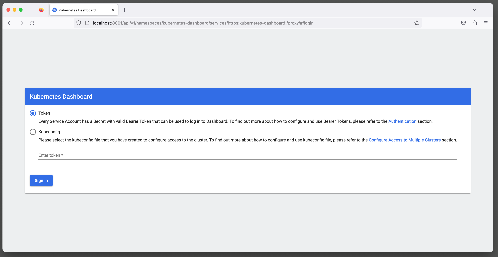

# Kubernetes Dashboard Quickstart

Kubernetes Dashboard is a general purpose, web-based UI for Kubernetes clusters. It allows users to manage applications running in the cluster and troubleshoot them, as well as manage the cluster itself.

Kubernetes Dashboard runs via https on localhost using ```kubectl proxy``` as a local web host that communicates with your Kubernetes cluster using kubectl. We do not create a traditional public facing ingress for this app simply because a security breach could be devastating. Nonetheless, it's pretty easy to connect to after some practice.

## Connecting to Kubernetes Dashboard

### 1. Start the proxy server in a new terminal window

```bash
mcdaniel@MacBookAir-Lawrence ~ % kubectl proxy
Starting to serve on 127.0.0.1:8001
```

### 2. Paste this url into any browser window

http://localhost:8001/api/v1/namespaces/kubernetes-dashboard/services/https:kubernetes-dashboard:/proxy/. You should see a signin page like the following



### 3. Use kubectl to generate a signin token

```bash
mcdaniel@MacBookAir-Lawrence ~ % kubectl -n kubernetes-dashboard create token kubernetes-dashboard

eyJhbGciOiJSUzI1NiIsImtpZCI6ImFlYzgwZmYwNmRkYmM5ZDEwYTFlZmI1YzYyOTI1ZDMwODAxNzE1ZWQifQ.eyJhdWQiOlsiaHR0cHM6Ly9rdWJlcm5ldGVzLmRlZmF1bHQuc3ZjIl0sImV4cCI6MTY3NjY4NTA1OSwiaWF0IjoxNjc2NjgxNDU5LCJpc3MiOiJodHRwczovL29pZGMuZWtzLnVzLWVhc3QtMi5hbWF6b25hd3MuY29tL2lkL0JERTMzOThBQTEwQUJDRjZFOUU3REUxMDQwMTY4QjdEIiwia3ViZXJuZXRlcy5pbyI6eyJuYW1lc3BhY2UiOiJrdWJlcm5ldGVzLWRhc2hib2FyZCIsInNlcnZpY2VhY2NvdWI-AM-NOT-REALLY-A-TOKENm5ldGVzLWRhc2hib2FyZCIsInVpZCI6IjdlNDU3MTM2LTFkMjEtNGQ3MC1hZTc2LTRkNzc1YWM1MzFhZCJ9fSwibmJmIjoxNjc2NjgxNDU5LCJzdWIiOiJzeXN0ZW06c2VydmljZWFjY291bnQ6a3ViZXJuZXRlcy1kYXNoYm9hcmQ6a3ViZXJuZXRlcy1kYXNoYm9hcmQifQ.b6SiY1qgOeTln969ZT0WhpZ8-SRcRAzC7J8zGGQzYpslZbNhpdg9298jT4evjc9jmD0JXGawr9NH2Q4cUDHj2BkThCbTRsqzR1uEDc8ibTedmiErdZC8HBBZvLLzNEuzXfgZdkX3FQI2U3ZyP7fhgy2o29VWhuPzJydHcXXX8SnGY27YpBlEkV0DJXi-mRDt3Ak0DvPQT8Uuk0gP26zQabO9kpfdlb5wb33AwaFaNe3T0BTFdnsSvvNX-Zby1phAwr2G5hbBO6FFi0DoialktdSIhKIl5OOOYRSaUdAumo5Y3FpNFBpAiryKOsNsq2o7Lxbwm0LwXJRZYweHr26SaQ
```

### 4. Paste the token into the signin page token field

You should be redirected to the Kubernetes Dashboard.


