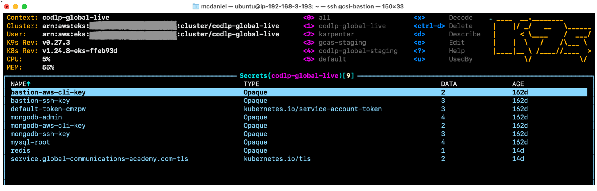
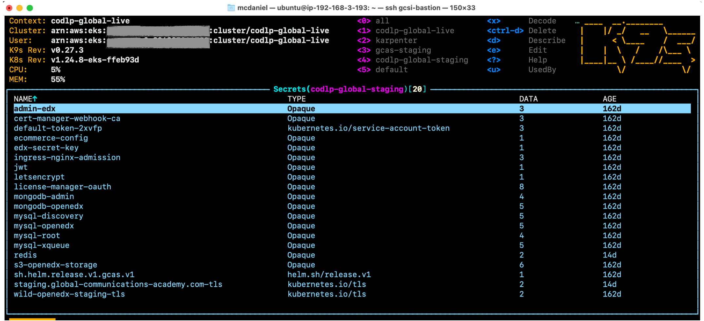
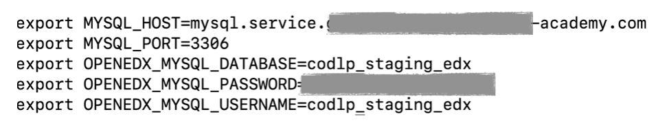
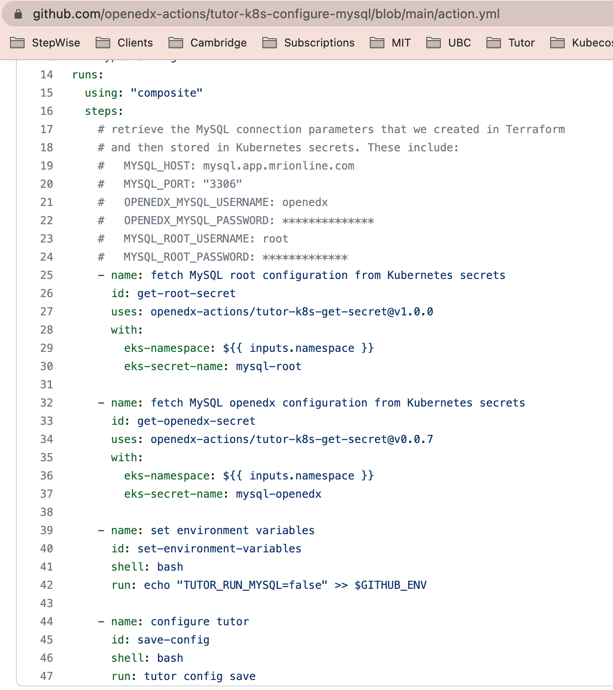

# Passwords, Credentials and Sensitive Data Management

All sensitive data, for Open edX software applications as well as for all AWS backend services and other resources, is stored in Kubernetes Secrets. All automation tools, including Github Actions as well as Bash scripts included in this repository, leverage kubectl to extract Kubernetes secrets data and then convert these data elements into Bash environment variables to be ingested on the command line. This is as effective a secrets strategy as it is generic. It works well for all situations, and helps to avoid the possibility of sensitive data leaking into console output and log data.

For the service stack containing your Kubernetes cluster you'll find the following Kubernetes Secrets.


For each Open edX environment deployed to Kubernetes you'll find the following Kubernetes Secretes.


## Basic Strategy

We leverage kubectl on the Bash command line for both Github Actions workflows as well as automation scripts on the Bastion server. Using kubectl we can extract a Kubernetes secrets as per the following example:

```bash
ubuntu@ip-192-168-3-193:~$ kubectl get secret mysql-openedx -n codlp-global-staging
NAME            TYPE     DATA   AGE
mysql-openedx   Opaque   5      162d
ubuntu@ip-192-168-3-193:$
```

But with marginally more effort, along with help from a command-line utility named jq, we can actually extract, decode and parse the data contained in the Secret:

```bash
ubuntu@ip-192-168-3-193:~$ kubectl get secret mysql-openedx -n codlp-global-staging  -o json | jq  '.data | map_values(@base64d)' |   jq -r 'keys[] as $k | "export \($k|ascii_upcase)=\(.[$k])"'
```



And finally, if we wrap the entire command line in ```$()``` then we can simultaneously execute each line of output as a Bash command, and voilá! We've gone from encoded Kubernetes secrets data to initialized Bash variables in a single stroke, and without exposing the contents.

## Usage in the Bastion server

This in fact has already been pre-packaged for you in the Bastion as a Bash helper script named ```ksecret.sh```, and is included in the PATH so that you can call it from anywhere inside the Bastion.

```bash
ubuntu@ip-192-168-3-193:~$ $(ksecret.sh mysql-openedx codlp-global-staging)
ubuntu@ip-192-168-3-193:~$
ubuntu@ip-192-168-3-193:~$ echo $OPENEDX_MYSQL_DATABASE
codlp_staging_edx
```

See Bash source: [ksecret.sh](../terraform/stacks/modules/ec2_bastion/scripts/ksecret.sh)

## Usage in Github Actions

If you inspect the Github Actions [openedx-actions](https://github.com/openedx-actions) then you'll find that the same basic strategy is used from within Github Actions workflows to extract sensitive data for purposes of configuring Open edX software. For example, here is a code snippet that sets Tutor variables for MySQL.



On line 34 of the screen shot you can see that openedx-actions/tutor-k8s-get-secret is called, and is passed a Namespace and a Secret name, the same as is used for the Bastion server.

See Github source: [openedx-actions/tutor-k8s-get-secret](https://github.com/openedx-actions/tutor-k8s-get-secret)
