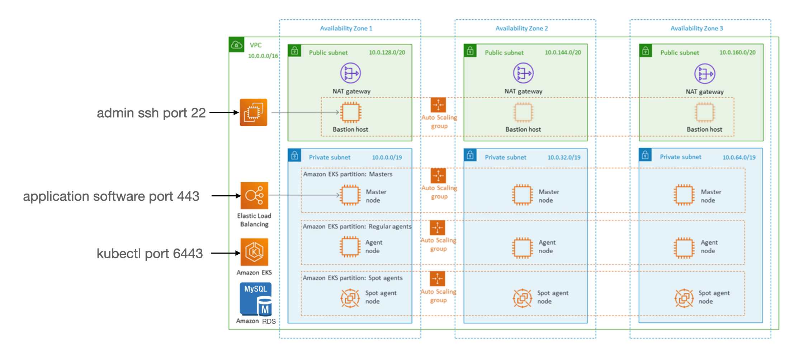

# System Administration Overview

All of the AWS resources that are generated by the Terraform scripts in this repo reside in a dedicated [VPC](https://docs.aws.amazon.com/vpc/latest/userguide/what-is-amazon-vpc.html) named {{ cookiecutter.global_platform_name }}-{{ cookiecutter.global_platform_region }}-{{ cookiecutter.global_platform_shared_resource_identifier }}. This VPC implements both public and private subnets for each availability zone in {{ cookiecutter.global_aws_region }}. It also implements dedicated subnets for database, k8s and cache traffic so as to minimize network contention between service layers. See source: [VPC](../terraform/environments/{{cookiecutter.environment_name}}/vpc/terragrunt.hcl)

The platform's general topology and attack surface consist of three public-facing ports:

- ssh port 22: open to the AWS EC2 Bastion server instance
- port 6443: open to the AWS Elastic Kubernetes Service kubectl listener node
- port 443: open to the AWS Classic Load Balancer implemented as part of the [Kubernetes Nginx ingress controller](https://docs.nginx.com/nginx-ingress-controller/) deployment. Note that port 80 is redirected to port 443 in all cases.

All application software for this stack, both user software as well as service stack admin packages, are deployed on Kubernetes and are made available with a common ingress. All ssl/tls certificates are also managed from Kubernetes using [cert-manager](https://cert-manager.io/docs/).

## Administrator Access

While it is technically possible to administer this software stack from your own dev machine, please bear in mind that this requires considerable software installation and configuration. Nuances in the versions of the multitude of sofware libraries and dependencies can cause strange side effects, which is why we created the Bastion for you.

- Kubernetes cluster access via [kubectl](https://kubernetes.io/docs/reference/kubectl/) is initially limited to the cluster creator. After running Terraform 'apply' to create the [AWS EKS](https://aws.amazon.com/eks/) cluster you will need to immediately modify the Kubernetes kube-system aws-auth configMap to add the Bastion IAM as well as the IAM user for any of your team members who require kubectl. Refer to the main [README](../README.rst) section, "VII. Add more Kubernetes admins" for instructions.
- The ssh private key for the Bastion server is stored as a [Kubernetes Secret](https://kubernetes.io/docs/concepts/configuration/secret/): {{ cookiecutter.global_platform_name }}-{{ cookiecutter.global_platform_region }}-{{ cookiecutter.global_platform_shared_resource_identifier }}/bastion-ssh-key
- The [aws cli](https://aws.amazon.com/cli/) keypair for the Bastion server is stored as a Kubernetes secret: {{ cookiecutter.global_platform_name }}-{{ cookiecutter.global_platform_region }}-{{ cookiecutter.global_platform_shared_resource_identifier }}/bastion-aws-cli-key
- The popular Kubernetes admin software application [k9s](https://k9scli.io/) is preinstalled and preconfigured on the Bastion server. To launch, type 'k9s' on the command line from anywhere.
- The MySQL root account credentials and connection string parameters are stored in a Kubernetes secret: {{ cookiecutter.global_platform_name }}-{{ cookiecutter.global_platform_region }}-{{ cookiecutter.global_platform_shared_resource_identifier }}/mysql-root

## Other network communications considerations

- AWS Security Groups are used extensively as a strategy for minimizing and tunneling port access where possible.
- AWS S3 access is managed by a single IAM user account that is created for this sole purpose.
- network communication within Kubernetes depends on multiple [AWS EKS Addons](https://docs.aws.amazon.com/eks/latest/userguide/eks-add-ons.html), including [CoreDNS](https://kubernetes.io/docs/tasks/administer-cluster/coredns/), [kube-proxy](https://kubernetes.io/docs/reference/command-line-tools-reference/kube-proxy/), and [Amazon VPC CNI](https://kubernetes.io/docs/concepts/extend-kubernetes/compute-storage-net/network-plugins/)
- Kubernetes [Persistent Volume Claims](https://kubernetes.io/docs/concepts/storage/persistent-volumes/) depend on the AWS EKS Addon [Amazon EBS CSI Driver](https://github.com/kubernetes-sigs/aws-ebs-csi-driver/blob/master/README.md)
- External public-facing access to MySQL and MongoDB are implemented indirectly, via the AWS EC2 bastion server instance. Therefore, providing ad hoc access to MySQL requires also providing an ssh private key to the Bastion server.

## AWS Command-line Interface

The aws cli itself is public facing but requires an IAM keypair to resolve permissions. This repo generates a single IAM keypair providing admin permissions, stored as a Kubernetes secret {{ cookiecutter.global_platform_name }}-{{ cookiecutter.global_platform_region }}-{{ cookiecutter.global_platform_shared_resource_identifier }}/bastion-aws-cli-key. This keypair in turn is automatically added to the AWS EC2 Bastion server instance during the initial build. The keypair was also manually added to this Github repository by [Lawrence McDaniel](https://lawrencemcdaniel.com/) using Github's Secrets feature in order to facilitate build and deploy workflow automation from Github Actions.
