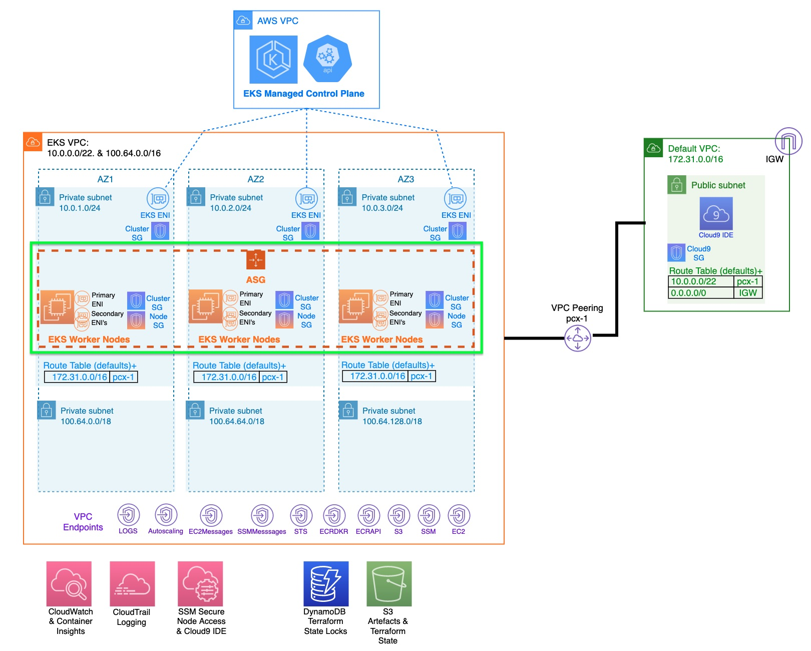

see:
    https://docs.aws.amazon.com/eks/latest/userguide/alb-ingress.html
    https://docs.aws.amazon.com/eks/latest/userguide/aws-load-balancer-controller.html

    https://www.youtube.com/watch?v=oYHZ3EPR094&t=1093s
    https://github.com/antonputra/tutorials/tree/main/lessons/038/

    https://www.youtube.com/watch?v=MZyrxzb7yAU
    https://antonputra.com/terraform/how-to-create-eks-cluster-using-terraform/
    https://github.com/antonputra/tutorials/tree/main/lessons/102

.. image:: doc/aws-vpc-eks.png
  :width: 100%
  :alt: AWS VPC EKS Diagram

